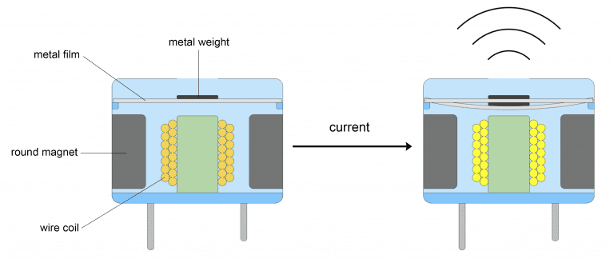
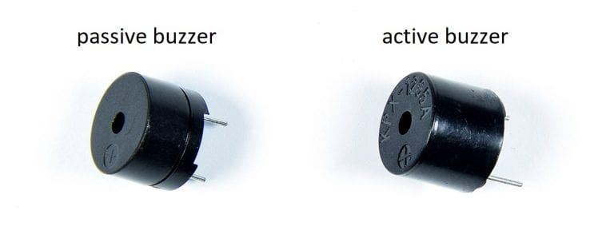
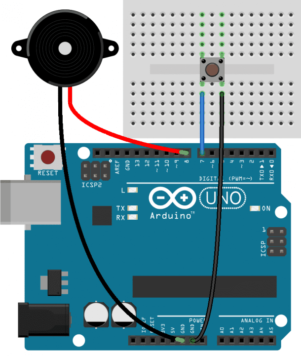

# Active Piezo Buzzer Module

- Piezoelectric buzzer produce a loud noise.When connected to the Arduino they can be used as an alarm or notification when a motion sensor is triggered,or when a sensor reached a certain value.
- The can also be programed to produce musical notes.
- There are two types of piezoelectric buzzer that are commonly used in electronics project -active buzzers and passive buzzers.
- Active buzzers are called active because they only need a DC voltage to produce sound.
- Passive buzzer need an AC voltage to produce sound.

- An easy way to tell active and passive buzzer apart is by connecting them to a DC voltage source like a 9 Volt battery.
- The puzzers are polarized,so check which terminal is positive and which terminal is negative before connecting it to a battery.
- When you connect a passive buzzer to a battery,the buzzer will make a sharp clicking sound.But when you connect an active buzzer to battery,the buzzer will make a loud buzzing noise.

## How Active Buzzers and Passive Buzzers work

- Active and passive buzzers are types of magnetic buzzers.
- Inside the buzzer,there is a coil of wire that's connected to the buzzer's pins.
- There are also a round magnet that sorrounds the wire coil.
- A thin metal film with a metal weight attached to the top sits above the round magnet and wire coil.
- when pulses of current are applied to the wire coil,magnetic inductance  causes the metal weight and metal film to vibrate up and down.
- The vibration of the metal film produces sound waves.

## How to connect An Arduino active buzzer to the Arduino

