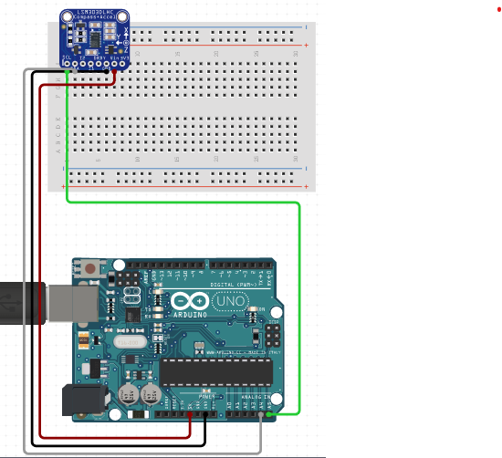

# C0041-Breadboard Power Supply Module

## Introduction

- The breadboard power supply module is a useful component that provides 5V, 3.3V or both power requirements to breadboard related projects. It has two independent channels of power output and can be easily connected to any DC power supply unit that has a 6.5-12V DC power output from a barrel jack. This module also offers a push switch to turn ON and OFF the entire power supply module.

## Image

## How to connect to a circuit

The module can be easily connected to a circuit by following these steps:

- Connect the DC power supply unit to the barrel jack input of the module.
- Select the desired voltage level (5V, 3.3V, or OFF) using the jumper on the left side of the module.
- Connect the GND, 5V, and 3.3V output pins of the module to the appropriate components on the breadboard using the onboard berg male header.

## The theory behind the components

- The breadboard power supply module consists of a DC-DC converter that converts the input voltage to the desired output voltage level. The voltage level can be selected using the jumper on the left side of the module. The module also includes a push switch to turn ON and OFF the entire power supply module and a power LED to indicate input power availability status.

## Features

- Two independent channels of power output for breadboards.
- Output voltage can be independently configured for 3.3V, 0V, and 5V operations.
- ON-OFF switch available.
- USB (Type-A) input available.
- DC Barrel jack input available.
- Onboard power LED.
- Maximum output current of 700mA.

## Statistics

- Input voltage range: 6.5V-12V.
- Output voltage: 5V, 3.3V (adjustable via jumper).
- Dimension: 53mm x 33mm.
