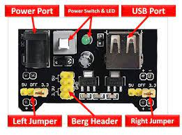

# Breadboard Power Supply Module

- The 3.3V/5V output MB102 Breadboard power supply module is an easy to use,most useful breadboard component that can be added with any breadboard related projects where 5V,3.3V or both power requirments are required.
- Its ease of use allows users to connect any DC power supply unit that has 6.5- 12V DC power output from a barrel jack.
- The board has two independent channels of power output for breadboards.These power channels can be independently configured for 3.3V,0V and 5V operations.

- The module also offers a push switch to turn OFF and ON the entire power supply module.
- An additional feature is a USB input with two 5V,two 3.3V and 4 GND pinout for additional power pin requirements.
- The power LED will notify the user of input power availablity status.

## Pin Description

### PIN Name-->Description

- LEFT jumper-->5V,OFF(0V),3.3V Selection
- LEFT jumper-->5V,OFF(0V),3.3V Selection
- 4-Berg Header--> GND 
- 2-Berg Header-->3.3V
- 2-Berg Header-->5.5V

## Feature and Speacifications

- Input voltage:6.5V-12V
- Two Independent channel
- Output voltage:5V,3.3V(Adjustable via jumper,0V,3.3V and 5V configuration)
- Output current:Maximum output current 700mA
- Onboard berg male header for GND,5V,3.3V output
- ON-OFF Switch available
- USB(Type-A ) input available.
- DC Barrel jack input available
- Onboard power LED
- Dimension:53mm X 33mm 
 
## The Parts of the Circuits
