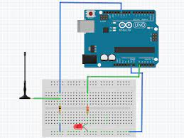

# C0011-Electrical fields sensor

## Introduction

- An Electromagnetic Field (EMF) Sensor is an electronic device that detects the presence of electromagnetic fields in a particular area. These fields can be generated by electrical appliances, power lines, or other sources of electrical energy.
- The EMF sensor can measure the strength of these fields and provide a reading that indicates the level of radiation present in the environment.

## Image

## How to connect to a circuit

- To connect an EMF Sensor to a circuit, you need to connect the following components:

- The ground pin of the Arduino to the negative (-) rail of the breadboard.
- Connect a 10k resistor from D11 to the antenna wire.
Connect the positive (+) rail of the breadboard to the A0 pin of the Arduino through a 220 resistor.

## The theory behind the components

- The 10k resistor connected to D11 helps to reduce the current flowing through the antenna wire to a safe level. The 220-ohm resistor connected to the A0 pin helps to protect the Arduino analog input from being damaged by excessive current.

## Features

- Some of the key features of an EMF Sensor include:

- Detects the presence of electromagnetic fields in a particular area
- Measures the strength of the fields and provides a reading that indicates the level of radiation present
Can be used to identify issues with power lines and electrical wiring
- Easy to connect to an Arduino or other microcontroller

## Statistics

- According to the World Health Organization, prolonged exposure to high levels of electromagnetic fields can be harmful to human health. Therefore, EMF sensors are useful in detecting and monitoring these fields to help ensure the safety of people in the environment.
- EMF sensors are widely used in the fields of medicine, research, and industry to detect and measure electromagnetic fields.
