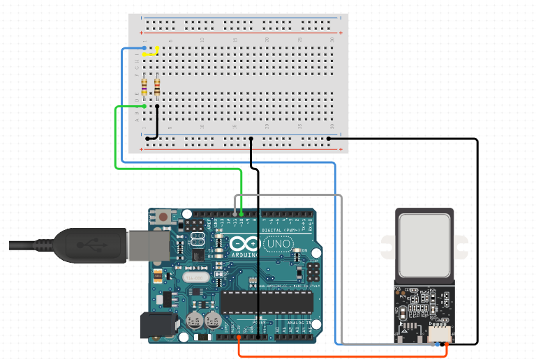

# Description of the component

A fingerprint sensor is an electronic device that captures and reads the unique pattern of ridges and valleys on the surface of a fingertip to authenticate a person's identity.

## Image

## How to connect to a circuit

The fingerprint sensor module requires a power supply of 3.3V and maximum current supply of 60mA. It communicates with a microcontroller through serial communication using the TX and RX pins. The GND pin is connected to the ground of the circuit.

## The theory behind the component

The fingerprint sensor module captures an image of a person's fingerprint using either an optical or capacitive sensor. An optical sensor uses light to illuminate the finger and capture the fingerprint image, while a capacitive sensor uses an electric current to sense the ridges and valleys on the fingertip. Once the fingerprint image is captured, it is processed and compared to the registered fingerprints stored in the module's memory to authenticate the person's identity.

## Features

Supply voltage: 3.3V
Maximum current supply: 60mA
Resolution: 500dpi
Maximum fingerprint imaging time: 1s
All registered fingerprints are stored in the module's memory.

## Statistics

The fingerprint sensor module has a resolution of 500dpi and can capture and process a fingerprint image in as little as 1 second. The accuracy of the sensor can vary depending on the quality of the image and the number of registered fingerprints in its memory.
