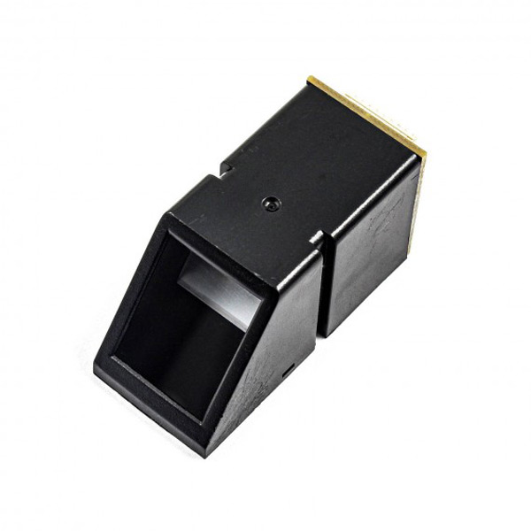
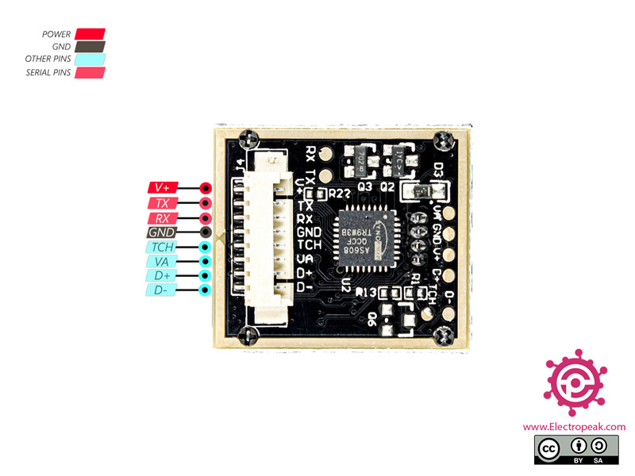
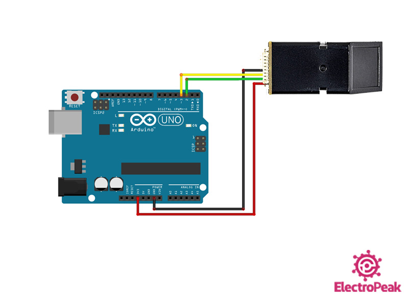

# Finger Print Sensor

- A finger print sensor is a device that captures an image of a person's fingerprint and uses it to authenticate their identity.
- The basic principle behind a fingerprint sensor is to capture the unique pattern of ridges and valleys on the surface of the fingertip.
- There are two main types of fingerprints sensors.

1. Optical Sensor
2. Capacitive Sensor

- Optical Sensor use light to capture the fingerprint image,while capacitive sensors use electronic current.

- The optical fingerprint sensor can be used to scan fingerprint and it can send the proccessed data to a microcontroller via serial communication as well.
- All registered fingerprints are stored in this module.

## Special Features

- Supply voltage 3.3V
- Maximum current supply 60mA
- Resolution 500dpi
- Max fingerprint imaging time 1s

## Pin configuration

- V+ - module power supply 3.3V
- GND - Ground
- TX - Serial Transmitter
- RX - Serial Transmiter

## Circuit Diagram

