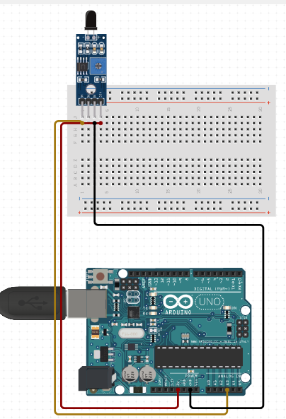

# C0034-Flamem IR Sensor

## Introduction

- A Flame Sensor or Flame Detector is a device designed to detect and respond to the presence of a flame fire. The IR Flame Sensor is a simple yet effective way to detect fire and is commonly used in commercial buildings and factories.

## Image

## How to connect to a circuit

- The Flame Sensor module has three pins: VCC, GND, and Dout. Connect VCC and GND to a 3.3V-5V power supply and ground, respectively. The Dout pin is the digital output and should be connected to a digital input pin on a microcontroller or other digital device.

## The theory behind the components

- The Flame Sensor module consists of an IR photodiode (IR receiver), resistor, capacitor, potentiometer, and LM393 comparator in an integrated circuit. When a fire burns, it emits a small amount of infrared light which is received by the IR receiver. The LM393 comparator is used to check for a change in voltage across the IR receiver. If a fire is detected, the output pin (Dout) will give 0V (LOW), and if there is no fire, the output pin will be 5V (HIGH). The sensitivity of the sensor can be adjusted by varying the onboard potentiometer.

## Features

- Detects infrared light with a wavelength ranging from 700nm to 1000nm
- Detection angle of about 60 degrees
- Sensitivity can be adjusted by varying the onboard potentiometer
- Working voltage is between 3.3V and 5V DC, with a digital output
- Logic high on output indicates the presence of flame or fire
- Logic low on output indicates the absence of flame or fire

## Statistics

- Some common applications of the Flame Sensor include hydrogen stations, combustion monitors for burners, oil and gas pipelines, automotive manufacturing facilities, nuclear facilities, aircraft hangars, and turbine enclosures.