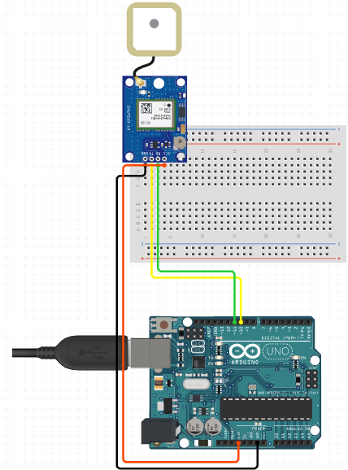

# GPSNEO6m Module

## Introduction

- The GSM NEO 6m Module is a GPS (Global Positioning System) module that can receive and process signals from navigation satellites orbiting the earth to determine its location. This module is compact and packed with features, making it a popular choice for DIY projects that require accurate positioning information.

## Image

## How to connect to a circuit

- To connect the NEO-6M GPS module to an Arduino circuit, you need to connect the module's four pins to the corresponding pins on the Arduino. The GND pin goes to the Arduino's GND pin, the TxD pin goes to the Arduino's RX pin, the RxD pin goes to the Arduino's TX pin, and the VCC pin goes to the Arduino's 5V pin.

## The theory behind the component

- The NEO-6M GPS module works by receiving signals from navigation satellites orbiting the earth. Once the module receives signals from at least three GPS satellites, it can determine its location using a process called trilateration. The GPS chip inside the module is responsible for tracking up to 22 satellites over 50 channels and achieving the highest level of tracking sensitivity in the industry. The module also comes with a 3.3V LDO regulator, a rechargeable battery, and an EEPROM for retaining critical data.

## Features

- The NEO-6M GPS module has several features that make it a popular choice for DIY projects, including:

- High tracking sensitivity of -161 dBm
- Ability to track up to 22 satellites over 50 channels
- 2.5m horizontal position accuracy
- 5 location updates per second
- Time-To-First-Fix of less than 1 second
- 3.3V LDO regulator for stable power supply
Battery and EEPROM for retaining critical data
- Patch antenna with -161 dBm sensitivity

## Statistics

- The NEO-6M GPS module consumes only 45mA current and has a MICREL's MIC5205 Ultra-Low Dropout 3V3 regulator. The HK24C32 Two Wire serial EEPROM is 4KB in size and is connected via 12C to the NEO-6M chip. The module's patch antenna has a sensitivity of -161 dBm. The GPS chip inside the module can track up to 22 satellites over 50 channels and achieve the industry's highest level of tracking sensitivity. The module can perform 5 location updates in a second with 2.5m horizontal position accuracy, and it has a Time-To-First-Fix of less than 1 second
