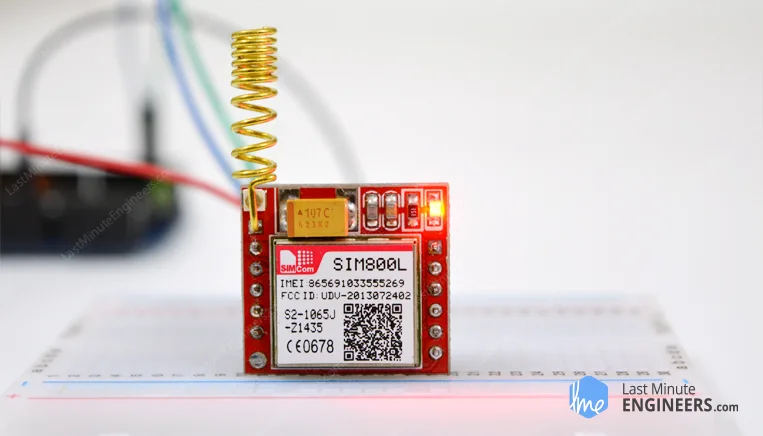

#  SIM800L GSM Module

- You can use this project to accomplish almost anything that a normal call phone can do such as sending SMS massages,making phone calls, connecting to the internet vis GPRS,and much more.
 
 ##  Hardware Overview
 - The chip's operating voltage ranges from 3.4V to 4.4V, making it an ideal candidate for direct LiPo battery supply.
 - This makes it a good option for embedding in projects that are short of space.
  
 

- All the necessary data pins of the SIM800L GSM chip are broken out to a 0.1" pitch headers, including the pins for communication with the microcontroller over the UART.
- The module supports baud rate from 1200bps to 115200bps with auto baud detection. 
- An external antena is needed for the module to be connected to the network.
- The module usually comes with a helical antenna that can be soldered onto the module.
- The board also feature a U.FL connector in case you want to keep the antenna away from the board.
 

- There's a SIM socket on the back any 2G Micro SIM card will work perfectly.

## Features
  - Connect onto any global GSM network with any 2G SIM
  - Make and receive voice calls using an external 8 ohoms speaker and electronic microphone. 
  - Send and receive SMS Massages
  - Send and receive GPRS data
  - Scan and receive FM radio broadcasts

  ## LED Status Indicators
  - On the top right of the SIM800L module is an LED that indicates the status of your cellelar network.
  - It blinks at different rates depending on which state it is in.
  
   
  
  
  
<Strong>Blink every 1s</Strong>

    - The module is running but the connection to the cellular network has not yet been made 
     
    
    
Blink every 2s

    - The GPRS data connected you requested is active.
     
    
    
 Blink every 3s

    - The module has made contact with the cellular network and can send/receive voice and SMS

    

## SIM800L GSM Module pinout
    
    

 
 - "NET" is a pin where you can solder the helical antenna provide with the module.
 - "VCC" supplies power to the module.it can be anywhere from 3.4V to 4.4V.Remeber that connecting this to the 5V will probably damage your module.
 - "RST(Rest") is a hard reset pin.If you got the module in an absolutely bad space,pull this pin low for 100ms to perform a hard rest.
 - "RxD(Receiver) pin is used to sent commands to the module.This pin is auto-baud so the baud rate at which you send the "AT" command after reset is the baud rate.
 - "GND" is the Ground Pin
 - "RING" pin acts as a Ring indicator. This is basically the 'Interrupt-out' pin from the module.It is HIGH by defalt and pulses LOW for 120ms when a call is received.it can be configured to pulse when SMS is received.
  - "DTR" pin actives/deactives the sleep mode.Pulling it HIGH will put the module into sleep mode,disabling serial communication.Pulling it LOW will wake up the module.
  - "MIC" is a differential microphone input.A microphone can be connected directly to these two pins.
  - "SPK" is a differential speaker interface.A speaker can be connected directly to these two pins.
  ## Wiring a SIM800L GSM Module to an Arduino
  
