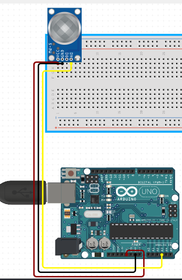

# C0037-MQ2 Gas Sensor

The MQ2 gas sensor is a widely used MOS (Metal Oxide Semiconductor) sensor that can detect various types of gases including LPG, Smoke, Alcohol, Propane, Hydrogen, Methane and Carbon Monoxide. It is often used in gas leakage detection devices in homes, industries, and automobiles.

## Image

## How to Connect to a Circuit

- The MQ2 gas sensor operates on 5V DC and has four pins - VCC, GND, A0, and D0. To use the sensor, connect the VCC and GND pins to a 5V power supply and ground respectively. The A0 pin outputs an analog signal which can be connected to an analog input pin on a microcontroller such as Arduino. The D0 pin outputs a digital signal which can be connected to a digital input pin on a microcontroller.

## The Theory Behind the Components

- The MQ2 gas sensor has a sensing element made of Aluminum Oxide (Al2O3) based ceramic with a Tin Dioxide (SnO2) coating. When the SnO2 semiconductor layer is heated to a high temperature, oxygen is adsorbed on the surface. In the presence of reducing gases, the absorbed oxygen reacts with the gases, lowering the potential barrier and allowing current to flow through the sensor. The sensor also has a heating system composed of a Nickel-Chromium coil and an Aluminum Oxide-based ceramic which ensures that the sensor area is continuously heated to the working temperature.

## Features

- Can detect various types of gases including LPG, Smoke, Alcohol, Propane, Hydrogen, Methane and Carbon Monoxide.
- Operates on 5V DC and consumes approximately 800mW.
- Provides both analog and digital outputs.
- Has a sensitivity adjustment potentiometer for the digital output.
- Includes power and status LEDs.

## Statistics

- Load resistance: 20K ohm
- Heater resistance: 33 ohm
- Sensing resistance: 10K ohm - 60K ohm
- Concentration range: 200 - 10000 ppm
- Preheat time: over 24 hours
