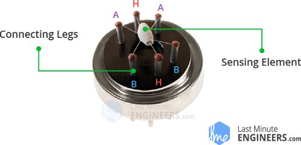
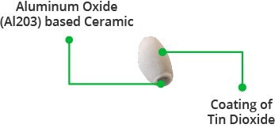
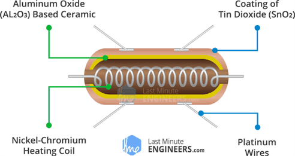
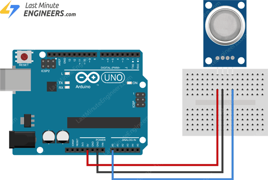

# MQ2 Gas Sensor

- The MQ2 sensor is one of the most widely used in the MQ sensor series.
- It is a MOS(Metal Oxide Semiconductor) sensor.
- Metal Oxide sensors are also known as Chemirestors because sensing is based on the change in resistance of the sensing material when exposed to gasses.

- The MQ2 gas sensor operates on 5V DC and consumes approximately 800mW.
- It can detect LPG,Smoke,Alcohol,Propane,Hydrogen,Methane and Carbon Monoxide concentrations ranging from 200 to 10000 ppm.

## Internal Structer of MQ2 Gas Sensor

- The MQ2 is a heater-driven sensor.
- It is therefore covered with two layers of fine stanless steel mesh known as an "Anti-exposion network".
- It ensures that the heater element inside the sensor does not cause an explosion because we are sensing flammable gasses.

- It also protects the sensor and filters out suspended particles,allowing only gaseous elements to pass through the chamber.
- A copper-plated clamping ring secures the mesh to the rest of the body.

- When the counter mesh is removed,the sensor looks like this.
- The sensing element and six connecting legs that extend beyond the Bakelite base form the star-shaped structure.
- Two(H) of the six leads are in charge of heating the sensing element and linked together by a Nickel-Chromium coil(a well-known conductive alloy).
- The remaining four signal-carrying leads(A and B) are connected with plantinum wires.
- These wires are connected to the body of the sensing element and convey slight variations in the current flowing through the sensing element.

- The tubular sensing element is made of Aluminum Oxide(AL203) based cermic with a Tin Dioxide coating(SnO2).
- Tin Dioxide is the most important material because it is sensitive to combustible gasses.
- The Cermic substrate,on the other hand,improves heating efficiency and ensure that the sensor area is continuously heated to the working tempurature.

- To summarize,the heating system is composed of a Nickel-Chromium coil and an Aluminum Oxide- based ceramic,while the Sensing System is composed of Platinum wire and a Tin Dioxide coating.

## Hoe does a gas sensor work?

- When a SnO2 semiconductor layer is heated to a high temperature,oxygen is adsorbed on the surface.
- When the air is clean,electrons from the conduction  band of tin dioxide are attracted to oxygen molecules.
- This creates an electron depletion layer just beneath the surface of the SnO2 particles,forming a potential barrier.
- As a resuilt,the SnO2 film become highly resisteve and prevents elctric current flow.
- In the presence of reducing gasses,however,the surface density of absorbed oxygen decreases as it reacts with the reducing gasses,lowering the potential barrier.
- As the result,electrons are released into the tin Dioxide,allowing current to freely flow through the sensor.

## MQ2 Gas Sensor Module Hardware Overview

- The MQ2 gas sensor is simple to use and has two different outputs.
- It not only provides a binary indication of the presence of combustible gasses,but also an analog representation of their concentration in air.

- The sensor's analog output voltage (at the A0 pin) varies in proportion to the concentration of smoke/gas.
- The higher the concentration,the higher the output voltage.The lower concentration the lower output voltage.
- The animation below shows the relationship between gas concentration and output voltage.

- This analog signal is digitized by a LM393 high precision comparator and made available at the Digital output(D0)pin.

- The module includes a potentiometer for adjusting the sensitivity of the digital output (D0).

- In addition,the module has two LEDs.
- The power LED illuminates when the module is turned on,and the status LED illuminates when the gas concentration exceeds the threshold value.

## Technical Specifications

- Operating Voltage 5V 
- Load resistance 20K ohom
- Heater resitance 33ohom
- Heating consumption <800mw
- Sensing Resistance 10K ohom-60 K ohoms
- Concentration Range 200 - 10000ppm
- Preheat Time -over 24 Hour

## Circuit Diagram

