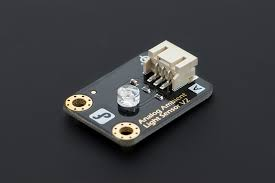

# Gravity Sensor

- The Gravity sensor is what android called a 'software sensor' and calculates its values using more than one hardware sensor.
- The software Gravity sensor is only available if the device has a gryroscope.
- The gravity sensor provides a three diamensional vector indicating the direction and magnetic of gravity.
- Typically,this sensor is used to determine the device's relative orientation in space
- In civil engineering, gravity sensors can be used to detect anything under the ground that creates a mass difference.
- They could help find buried infrastructure such as pipes,tunnels and old mine shafts

## Circuit Diagram

