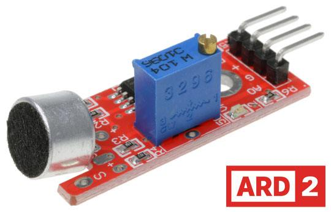

# High Sensitivity Microphone Sensor

- This module features a sensitive microphone for detecting sound.
- If features both a digital and an anlog output.
- The digital pin can output either a high or low signal indicating when sound intensity has reached a certain threshold.
- The sensitivity threshold can be adjusted via the potentiometer on the sensor.
- This means that the sensor emits a digital high signal soon as a threshold value set by the user is exceeded.
- However this also means that the analog measured values are not suitable for conversions,as the analog signal is also influenced by the rotary potentiometer.
- Digital Output: Via the potentiometer,a limit value for the received sound can be sent,at which the digital output should switch
- LED1: Indicates that the sensor is powered
- LED2: Indicates that a noise has been detected.

## Funtions

- This sensor has three funtional components on its circuit board
- The front sensor unit,which physically measures the environmental and output is as an analog signal to the second unit,the amplifier.
- This amplifiers the signal depending on the resistance set on the rotary potentiometer and sends it to the analog output of the module.
- The third unit represents a comparator,which switches the digital output and the LED when the signal falls below a certain value.
- The value(and thus the sensitivity of the module) can be adjusted via the rotary potentiometer.

## Features

- Detect sound intensity
- Pair with SD Card to create a simple audio recorder.
- Digital and analog output
- Sensitivity threshold can be adjusted via potentiometer.

## Specifications

- Sensitivity--> Adustable Via trimpot
- Operating Voltage--> 0-5.0V DC(Analog)
- Supply Voltage--> 5.0V DC
- Additional Features--> Digital Threshold Comparator
- Color-->Red
- Meterial-->PCB

## Pin configuration

## Dimensions

- Length(mm)-->43
- Width(mm)-->16
- Height(mm)-->13

## The Circuit Diagram

