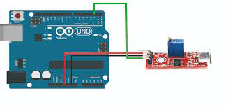

# C0032-High Sensitivity Microphone sensor

The high sensitivity microphone sensor is an Arduino-compatible module that can detect sound intensity and output it as either a digital or analog signal. It features a sensitive microphone and a potentiometer that allows the user to adjust the sensitivity threshold of the module.

## Image

## How to Connect to a Circuit

The sensor has 4 pins that can be connected to an Arduino board. The VCC pin should be connected to the 5V pin on the Arduino, the GND pin to the ground pin, the D0 pin to any digital input pin on the Arduino, and the A0 pin to any analog input pin on the Arduino.

## The Theory Behind the Components

The sensor has three functional components on its circuit board. The front sensor unit physically measures the environmental sound and outputs it as an analog signal to the second unit, the amplifier. This amplifier increases the signal depending on the resistance set on the rotary potentiometer and sends it to the analog output of the module. The third unit represents a comparator, which switches the digital output and the LED when the signal falls below a certain value. The value (and thus the sensitivity of the module) can be adjusted via the rotary potentiometer.

## Features

- Detect sound intensity
- Pair with SD Card to create a simple audio recorder
- Digital and analog output
- Sensitivity threshold can be adjusted via
 potentiometer

## Statistics

- Sensitivity: Adjustable via trimpot
- Operating Voltage: 0-5.0V DC (Analog)
- Supply Voltage: 5.0V DC
- Additional Features: Digital Threshold Comparator
- Color: Red
- Material: PCB
- Dimensions: Length 43mm, Width 16mm, Height 13mm
