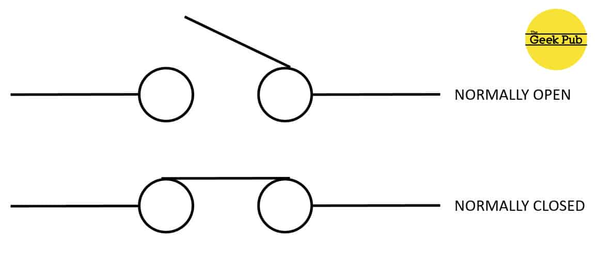
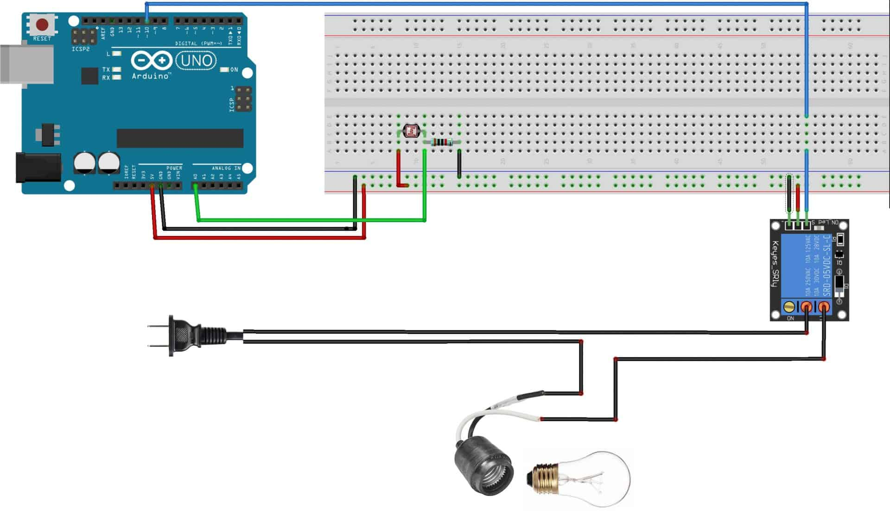

# High Voltage Relay Module

- One of the best of the Arduino is the ability to connect relays.
- Relays allow a circuit of one voltage or current to be operated by a circuit of a different voltage or current.
- In the case of Arduino that operates at either 3.3V or 5V DC,connecting a relay allows us to operate a device that uses 110V to 240V AC.
- Simply put with a relay your Arduino can control your coffee maker,a lamp,or other high voltage device.

## Understanding the 5V Relay

- the relay we chose is already mounted on a circuit board,and includes screw terminals.
- The pin on the board are the low voltage terminals and will connect to Arduino.
- The screw terminals are the high voltage side of the relay and these will connect to our lamp.

- On the low voltage side of the relay you'll see three pins.There should be labeled GND,VCC and S.
- GND is for ground.VCC is for +5V, and S is for signal.
- On the high voltage side of the relay have three srew terminals that should be labeled,NC,C and NO.
- NC is for normally-closed,No is for normally-open, and C is for common.

## Normally-Closed VS. Normally Open Contacts

## Controlling a relay with a photoresistor

