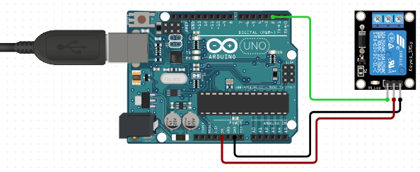

# C0031-High Voltage Relay Module

The high voltage relay module is an Arduino-compatible device that allows you to control high voltage devices with your Arduino. With the help of a relay, you can operate a device that uses 110V to 240V AC, using the 3.3V or 5V DC supplied by your Arduino.

## Image

## How to connect to a circuit

The low voltage side of the relay has three pins - GND, VCC, and S. These pins will connect to your Arduino board. The high voltage side of the relay has three screw terminals - NC, NO, and C. These terminals will connect to your high voltage device.

## The theory behind the components

A relay is an electrically operated switch. It allows a circuit of one voltage or current to be operated by a circuit of a different voltage or current. In the case of the high voltage relay module, the low voltage side of the relay is connected to your Arduino, and the high voltage side of the relay is connected to your high voltage device.

## Features

The high voltage relay module comes with the following features:

- It is an Arduino-compatible device
- It allows you to control high voltage devices with your Arduino
- It comes with a pre-mounted relay and screw terminals for easy connection
- The low voltage side of the relay has three pins - GND, VCC, and S
- The high voltage side of the relay has three screw terminals - NC, NO, and C

## Statistics

- There are various types of high voltage relay modules available in the market.
- The one mentioned in this tutorial is a 5V relay module.
- It can handle up to 10A current and 250V AC voltage. The module comes with a pre-mounted SRD-05VDC-SL-C relay.
