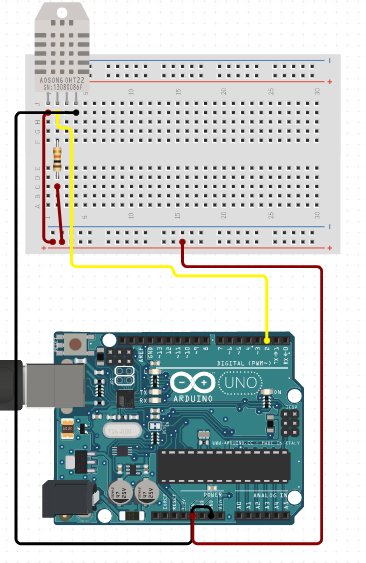

# C0006-Humidity sensor

A humidity sensor is a device that detects and measures the relative humidity of the air or the amount of water vapor present in gas mixtures. It works by detecting changes that alter electrical current or temperature in the air.

## Image

## How to connect to a circuit

The VCC pin of the humidity sensor is connected to the 5V pin and the GND pin is connected to the GND. The signal pin is connected to the analog input port A0 on the microcontroller.

## The theory behind the components

- There are three basic types of humidity sensors - capacitive, resistive, and thermal. 
- Capacitive humidity sensors measure the change in capacitance between two electrodes caused by the adsorption of water molecules. 
- Resistive humidity sensors measure the change in resistance of a material due to water absorption or desorption.
- Thermal humidity sensors measure the change in temperature of a surface caused by the evaporation or condensation of water.

## Features

- Humidity sensors have a range of features including measurement range, sensitivity, accuracy, response time, and stability. 
- They can also have built-in temperature sensors and can operate over a range of temperatures and humidity levels.

## Statistics

- Humidity sensors have a range of measurement ranges, sensitivities, and accuracies. For example, a typical capacitive humidity sensor might have a measurement range of 0-100% RH, a sensitivity of 0.5% RH, and an accuracy of +/-2% RH.
- The response time and stability of a humidity sensor can also vary depending on the type and manufacturer.
