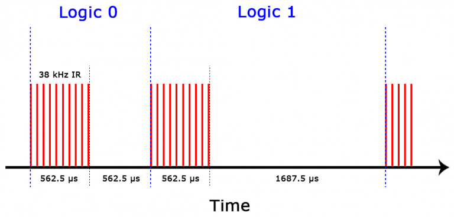

# Infrared Transmitter

- A typical infrared communication system requires an IR transmitter and an IR receiver.
- The transmitter looks likec a standard LED,expect it produces light in the IR spectrum instead of the visible spectrum.
- If you have a look at the front of a TV remote,you'll see the transmitter LED.

- The same type of LED is used in IR transmitter breakout boards for the Arduino.
- You can see it at the front of this Keyes IR transmitter.

- The IR receiver is a photodiode and pre-amplifier that convert the IR light into an electrical signal.
- IR receiver diodes typically look like this

Some may come on a breakout board like this.

## IR Signal Modulation

- IR light is emitted by the sun,light bulbs,and anything else that produces heat.
- That means there is a lot of IR light noise all around us.
- To prevent this noise from interfering with the IR signal,a signal modulation technique is used.
- In IR signal modulation,an encoder on the IR remote converts a binary signal into a modulated electrical signal.
- This electrical signal is sent to the trasmitting LED.
- The transmitting LED converts the modulated electrical signal into a modulated IR light signal.
- The IR receiver then demodulates the IR light signal.
- The IR receiver then demodulates the IR light signal and converts it back to binary before passing on the information to a microcontroller.

- The modulated IR signal is a series of IR light pulse switched on the off at a high frequency known as the carrier frequency.
- The carrier frequency used by most transmitters in 38kHz,because it is rere in nature and thus can be distinguished from ambient noise.
-This way the IR receiver will know that the 38kHz signal was sent from the transmitter and not picked up from the surrounding envirenment.
- The receiver diode detects all frequincies of IR light,but it has a band-pass filter and only lets through IR at 38kHz.
- It then amplifies the modulated signal with a pre-amplifier and converts it to a binary signal before sending it to a microcontroller.

## IR Transmission Protocols

- The pattern in which the modulated IR signal is converted to binary is defined by a transmission protocol.
- There are many IR transmission protocols.Sony,Matsushita,NEC and RC5 are some of the more common protocols.
- The NEC protocol is also the most common type in Arduino projects,so l'll use it as an example to show you the receiver converts the modulated IR signal to a binary one.
- Logical '1' starts with a 562.5 micro seconds long HIGH pulse of 38 kHz IR followed by a 1687.5 micro sencond long LOW pulse.
- Logical '0' is transmitted with a 562.5v micro second HIGH pulse followed by a 562.5 micro second long LOW pulse.

- This is how the NEC protocol encodes and decodes the binary data into a modulated signal.
- Other protocols differ only in the duration of individual HIGH and LOW pulses.

## IR Codes

- Each time you press a button on the remote control,a unique hexadecimal code is generated.
- This is the information that is modulated and sent over IR to tha receiver.
- In order to decipher which key is pressed,the receiving microcontroller needs to know which code corresponds to each key on the remote.
- Different remotes send different codes for the keypresses,so you'll need to determine the code generated for each key on your particular remote.
- If you can find the datasheet,the IR key codes should be listed.
- If not though,there is a simple Arduino sketch that will read most of the popular remote controls and print the hexadecimal codes to the serial monitor when you press a key.

## How to connect an IR receiver to the Arduino

- The pin layout on most breakout boards looks like this,

- The pinout of most stand-alone diodes is like this.

-To connect a breakout board mountaited IR receiver, hook it up to the Arduino like this,

