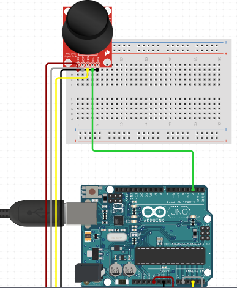

# C0028Joystick Module

The Joystick Module is a popular input device that is commonly used in retro gaming, robot control, and remote-controlled (RC) cars. The module has two potentiometers connected together, one for the vertical movement (Y-axis) and the other for the horizontal movement (X-axis), which work together to control the position of the joystick. Additionally, the joystick module also comes with a select switch that can be used to select different options.

## Image

## How to Connect to a Circuit

To use the joystick module with an Arduino board, you can connect the VRx pin to A0 and the VRy pin to A1 analog inputs, respectively. Additionally, the GND and +5V pins of the module need to be connected to the GND and +5V pins of the Arduino board.

## The Theory Behind the Components

The joystick module consists of two potentiometers, one for the X-axis and the other for the Y-axis. These potentiometers work like voltage dividers and produce an output voltage that is proportional to the position of the joystick. The Arduino board, which has an analog-to-digital converter (ADC) with a resolution of 10 bits, reads these voltages and converts them into digital values that range from 0 to 1023. By reading these values, the Arduino board can determine the position of the joystick.

## Features

The Joystick Module is a versatile input device that can be used for a wide range of applications. Some of its key features include:

- Two potentiometers for X and Y-axis control
- Select switch for different options
- Easy to use and connect to Arduino boards
- Provides accurate position control

## Statistics

- The Joystick Module is a popular input device among hobbyists and makers.
- It is widely available and affordable, making it accessible to anyone who wants to use it.
- Its ease of use and versatility have made it a popular choice for controlling robots, RC cars, and retro games.
