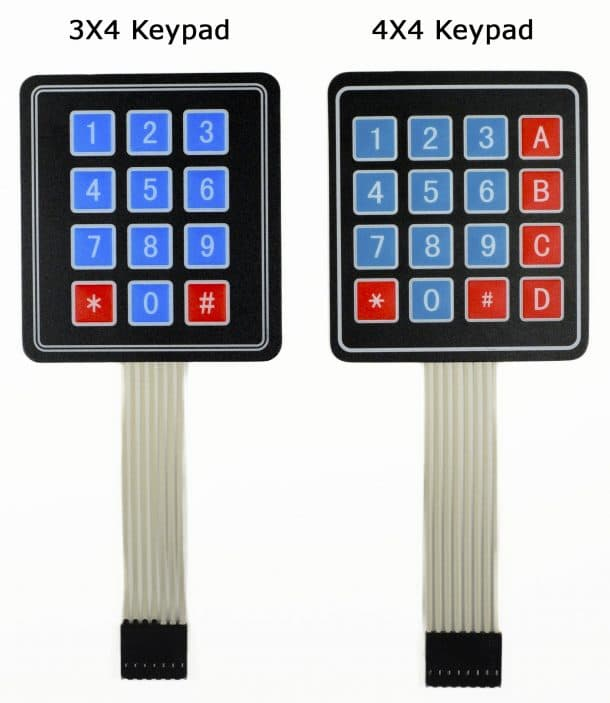
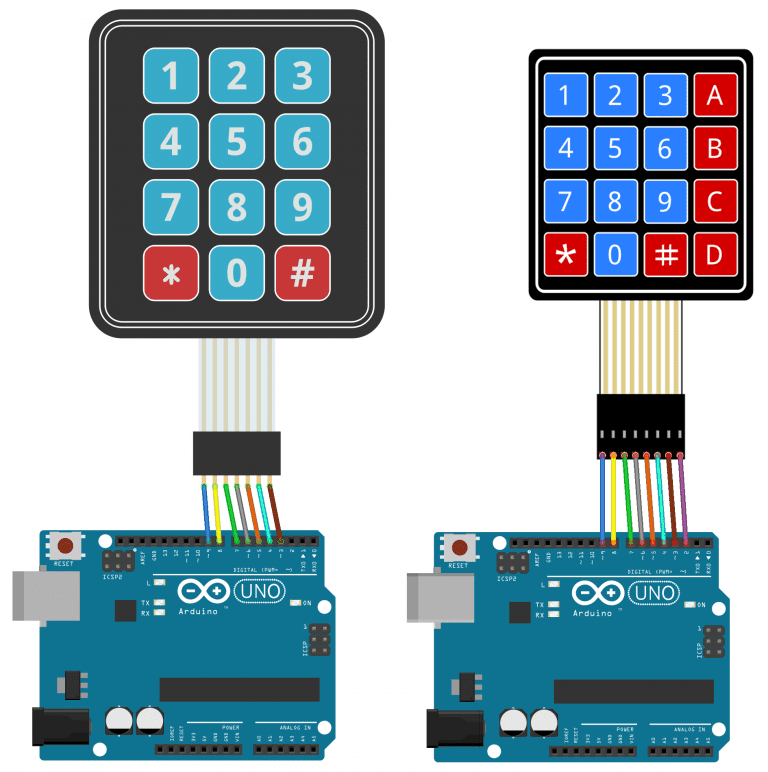

# Keypads Arduino

- The buttons on a keypad are arrange in rows and columns.A 3X4 keypad has 4 rows and 3 coloumns,and a 4X4 keypad has 4 rows and 4 columns.

- Beneath each key is a membrane switch.Each switch in a row is connected to the other switches in the row by a conductive trace inderneath the pad.
- Each switch in a column is connected the same way- one side of the switch is connected to all of the other switjches in that column by a conductive trace.
- Each row and column is brought out to a single pin,for a total of 8 pins on the 4X4 keypad.

- Pressing a button closes the switch between a column and a row trace, allowing current to flow between a column pin and a row pin.
- The schematic for a 4X4 keyboard shows how the rows and columns are connected.

- The Arduino detects which button is pressed by detecting  the row and column pin that's connected to the button.

- This happens in four steps.

1. First,when no buttons are pressed,all of the column pins are held HIGH,and all of the row pins are held LOW.

2.When a button is pressed,the column pin is pulled LOW since the current from the HIGH column flows to the LOW row pin.

3.The Arduino now knows which column the button is in,son now it just needs to find the row the button is in.It does this by switching each one of the row pins HIGH, and at the same time reading all of the column pins to detect which column pin returns to HIGH.

4.When the column pin goes HIGH again,the Arduino has found the row pin that is connected to the button.

- From the diagram above,you can see that the combination of row 2 and column 2 could only mean that the number 5 button was pressed.

## Connect the Keypad to the Arduino

- Follow the diagrams below to connect the keypad to an Arduino Uno,depending on whether you can have a 3X4 keypad.

