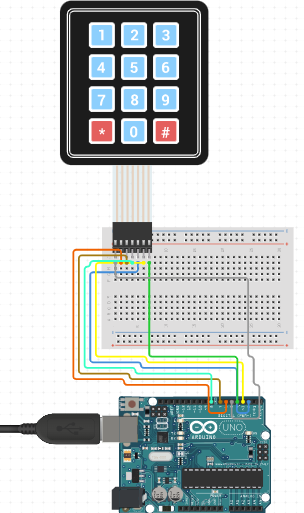

# C0040-Keypad

## Introduction

Keypads are a type of input device that allows users to enter data into a system by pressing buttons in a specific pattern. They are commonly used in security systems, door locks, and other applications that require user input. In this tutorial, we will discuss how to connect a keypad to an Arduino and how it works.

## Image

The keypad consists of a set of buttons arranged in rows and columns, which are connected to an Arduino board through a set of pins. A 3X4 keypad has 4 rows and 3 columns, while a 4X4 keypad has 4 rows and 4 columns. Beneath each button is a membrane switch that is connected to other switches in the same row or column through a conductive trace.

## How to Connect to a Circuit

To connect the keypad to an Arduino, follow the circuit diagram shown above, depending on whether you have a 3X4 or 4X4 keypad. The rows and columns of the keypad are connected to digital pins on the Arduino board.

## The Theory Behind the Components

When a button on the keypad is pressed, it closes the switch between a column and a row trace, allowing current to flow between a column pin and a row pin. The Arduino detects which button is pressed by detecting the row and column pin that's connected to the button. This is done by first setting all column pins to HIGH and all row pins to LOW. When a button is pressed, the column pin is pulled LOW, and the Arduino then switches each one of the row pins HIGH to detect which column pin returns to HIGH.

## Features

- The keypad is a low-cost and easy-to-use input device that can be integrated into a variety of projects. 
- It provides a simple and intuitive way for users to enter data into a system without the need for a separate keyboard or other input device.

## Statistics

- There are many different types of keypads available, ranging from simple 3X4 and 4X4 keypads to more complex matrix keypads with a larger number of buttons. 
- The cost and complexity of the keypad will depend on its size, the number of buttons, and the features it provides. Keypads are commonly used in a wide range of applications, from security systems and door locks to electronic projects and DIY devices.
