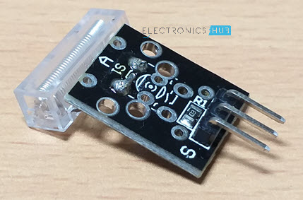
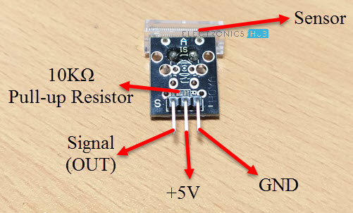
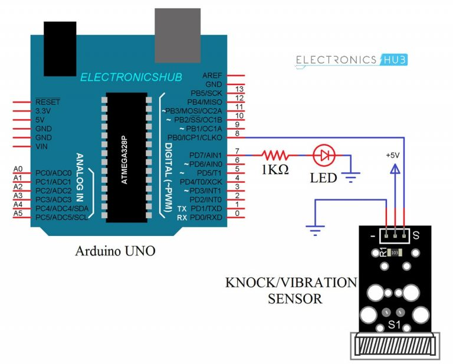

# Knock Sensor

- A knock Sensor or a Vibration Sensor is a simple device that detects vibrations or shocks from knocking or tapping it.
- It is basically an electronic switch which normally open.
- When it detects any shock or vibrations, it close(for that moment and returns back to its default open position.)
- Several Knock Sensors are available in the market and the cheaper ones are called KY-031 Knock Sensors.
- The following image shows the Knock Sensor Module used in this project.

## Components of a Knock/Vibration Sensor

- A typical knock sensor consists of the main sensing element,which is a conductive vibration spring,a Resistor and three Pins.
- The three pins of the Knock Sensor Module are GND,+5V and S.
- The following image shows the components of a Knock Sensor Module as well as the pins on it.

## Schematic of Knock Sensor

- In order to understand how a Knock Sensor Module works,I thing knowing its schematic is important.
- The following image shows a simplistic represantation of the schematic of a Knock Sensor Module.

## How does a Knock Sensor Work?

- If you take a look at the schematic of the knock sensor,it basically consists of a switch and a resistor.
- The output pins of the sensor(Which is connected to one end of the switch) is pulled HIGH with the help of a 10K ohoms Pull- up resistor.
- Under normal condition i.e when there is no there is no shock or vibrations,the output of the Knock Sensor is HIGH.
- When the sensor detects any vibrations or knocks,the vibrating spring i.e switch closes and hence the output of the sensor(at the output pin ) will become LOW.

## Circuit Diagram for Interfacing Knock Sensor with Arduino

- The following image shows the circuit daigram of interfacing a Knock Sensor with Arduino Uno.

