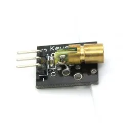
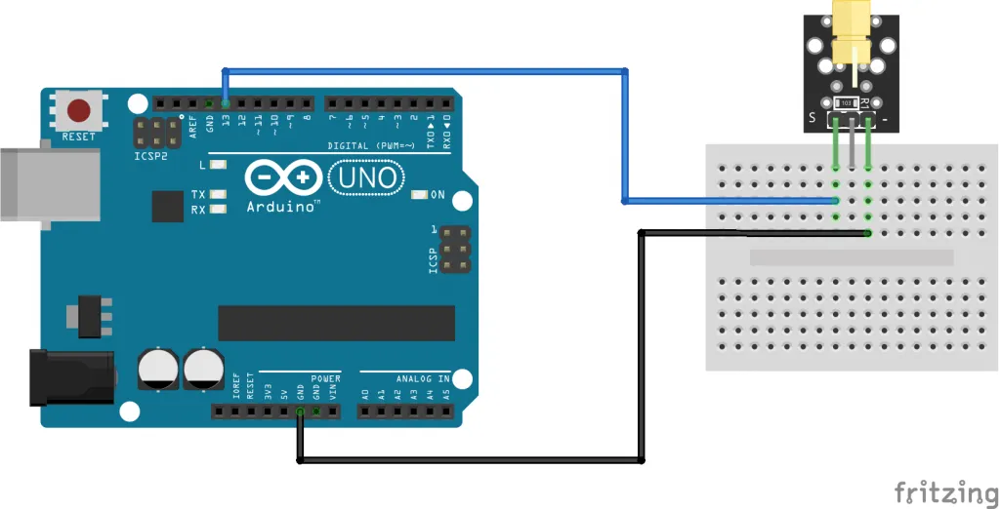

# Laser Module

- A laser module is an electronic component that emits a focused beam of coherent light.
- It typically consists of a laser diode, which is an electronic component that produces laser light,and a lens or other optical element that focuses the beam.
- The Laser Transmitter module can be used as a laser pointer.It emits a dot shaped,red laser beam.
- Compatible with Arduino,Raspberry PI,ESP32 and other popular microcontrollers.

## Specifications

- This module consists of a 650nm red laser diode head,a resistor and 3 male header pins.
- Haddle with caution, do not point the laser beam directly to the eyes.

- Operating Voltage 5V
- Output Power 5mW
- Wavelength 650nm
- Operating Current <40mA
- Working Temperature -10C ~ 40C
- Board Dimensions 18.5mm X 15mm

## Connection Diagram

- Connect the module signal pin(S) to pin 13 on the Arduino and ground (-) to GND.
- The middle pin on the module is not used.

