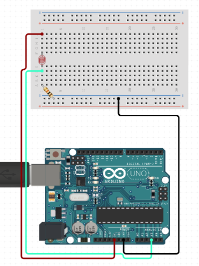

# C0001-Light Sensor

## Introduction to light sensors

Light sensors, also known as photodetectors or photo sensors, are electronic devices that detect and measure the intensity of light. They work by converting light energy into an electrical signal, which can then be used to perform various functions in electronic systems. Light sensors are crucial components in many everyday devices and industrial applications. There are several types of light sensors, each with its own method of operation

## What are light sensors used for
Light sensor module is used to detect the intensity of light. It has both analog output pin and digital output pin labeled as AO and DO respectively on the board. This sensor module is designed to detect and measure various physical properties, such as temperature, humidity, pressure, light intensity and more.

Light Dependent Resistors (LDRs), also known as photoresistors, are a type of light sensor that exhibits a change in resistance based on the intensity of light falling on them. 

Resistance and Light Intensity: LDRs are made of semiconductor materials. Their resistance decreases as the intensity of light increases. This property allows them to be used for detecting light levels in various applications.

## How do light sensors work

Light resistors, also known as Light Dependent Resistors (LDRs) or photoresistors, are electronic components that change their resistance in response to changes in light intensity. When exposed to light, the resistance of an LDR decreases, and when in darkness, the resistance increases. This unique property makes LDRs useful in several applications

## Digital and Analog Sensors

Light sensors can be digital or analog. Digital sensors provide a binary output (on/off) based on a certain light threshold, whereas analog sensors provide a continuous range of output values corresponding to the varying light levels.

## Output Type 

Light sensors can provide analog or digital output. Analog sensors produce a continuous range of output values corresponding to the detected light levels, while digital sensors provide discrete digital signals (such as ON/OFF) based on a predefined light threshold.

## Image

## How to connect it to a circuit

 - Connect the LDR(Also known as Light Dependent Resistor)to the analog input pin 0 on the Arduino board.
 - Connect the VCC leg on the sensor to the 5V pin of the Arduino board.
 - Connect the GRD leg on the sensor to the GND pin of the Arduino board.
 - A connection diagram is provided to illustrate the connections.

## The theory behind the components

- When there is light, the resistance of LDR becomes low according to the intensity of light.
- This means when the light level decreases, the resistance of the LDR increases.
- As this resistance increases in relation to the other resistor, which has a fixed resistance, it causes the voltage to be dropped across the LDR to also increase.
- Light sensors are a type of photodetector (also called photosensor) that detect light.
- Different types of light sensors can be used to measure illuminance, respond to changes in the amount of light received, or convert light to electricity.

## Features

Light sensors, also known as photodetectors or photo sensors, come with various features depending on their type and intended applications here are a few 
  examples.
 - The light sensor module has both analog and digital output pins.
 - It can be used to detect the intensity of light.
 - The sensitivity of the sensor can be adjusted using a potentiometer.
 - Light sensors are used in a wide range of applications, including automatic outdoor lighting systems, camera exposure control, ambient light sensing in 
  smartphones and tablets, industrial automation, and in solar energy systems to track the sun.

## Statistics:

- The working voltage of the light sensor module is between 3.3V and 5V DC.
- The detection angle is about 60 degrees.
- The sensor can detect light intensity ranging from 500 to 10,000 lux.
