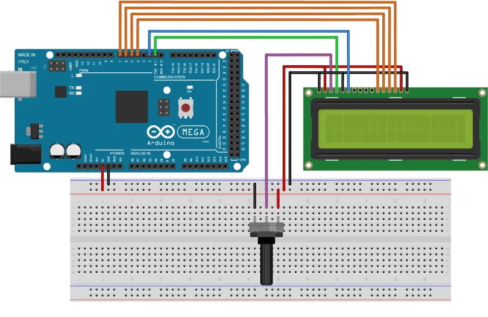

# C0045-Liquid crystal displays (LCDs)

## Introduction

- An LCD character display is a type of display that can output individual ASCII characters with fixed size. It consists of rectangular areas composed of a 5x8 pixel grid, with each pixel able to light up individually. The number of rectangular areas defines the size of the LCD, with the most popular being the 16x2 LCD.

## Image

## How to Connect to a Circuit

- The 16x2 LCD has 16 pins, with the first one being the ground pin and the second one being the VCC pin that connects to the 5V pin on the Arduino board. The V0 pin can be attached to a potentiometer for controlling the contrast of the display.
- The RS pin is used for selecting whether to send commands or data to the LCD. The P/W pin selects the mode for reading or writing to the LCD, with the write mode being used for sending commands and data to the LCD.
- The E pin enables writing to the registers or the next 8 pins from D0 to D7. The last two pins, A and K, are for the LED backlight.

## The Theory behind the Components

- The LCD character display consists of rectangular areas that compose a 5x8 pixel grid. Each pixel can light up individually, allowing the display of characters within each grid. The 16x2 LCD has two rows with 16 rectangular areas or characters.
- The RS pin selects whether to send commands or data to the LCD. The P/W pin selects the mode for reading or writing to the LCD, and the E pin enables writing to the registers or the next 8 pins from D0 to D7.

## Features

- Ability to output individual ASCII characters with fixed size
- Rectangular areas composed of a 5x8 pixel grid
- Popular sizes include 16x2, 16x4, 20x4
- Different background and text colors available
- Pinout includes 16 pins, with the first one being the ground pin and the second one being the VCC pin

## Statistics

- Pinout: 16 pins
- Size: Popular sizes include 16x2, 16x4, 20x4
- Pixel grid: 5x8
- Contrast control: Through a potentiometer attached to the V0 pin
