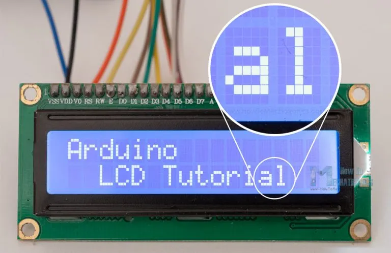
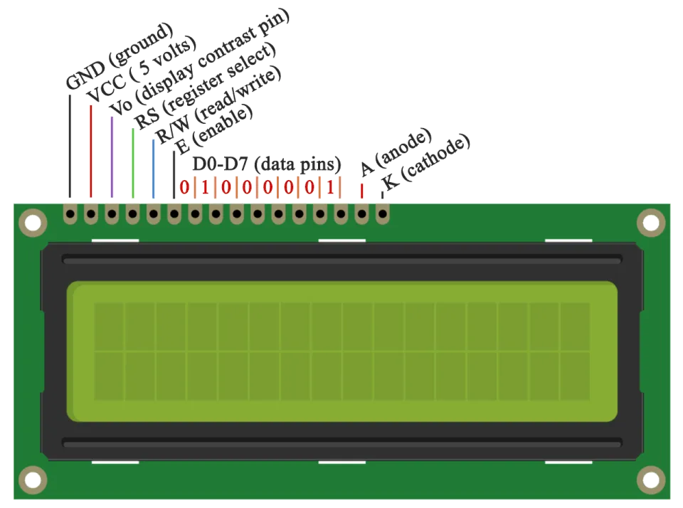

# Liquid Crytal Sensor

- An LCD character display is a unique type of display that can only output individual ASCII characters with fixed size.
- Using these individual characters then we can form a text.
- If we take a closer look at the display we can notice that there are small rectangular areas composed of 5X8 pixels grid.
- Each pixel can light up individually,and so we can generate characters within each grid.

- The number of the rectangular areas define the size of the LCD.
- The most popular LCD is the 16X 2 LCD,which has two rows with 16 rectangular areas or characters.
- Of course,there are other sizes like 16X 4,16X4,20X4 and so on,but they all work on the same principle.Also,these LCDs can have different background and text color.

## 16X2 LCD Pinout

- It has 16 pins and the first one from left to right is the GROUND pin.
- The second pin is the VCC which we connect the 5V pin on the Arduino Board.
- Next is the V0 pin which we can attach a potentiometer for controlling the contrast of the display.
- The RS pin or register select pin is used for selecting whether we will send commands or data to the LCD.
- For the example if the RS pin is set on the low state or zero volts,then we are sending commands to the LCD like.set the cursor to a specific location,clear the display,turn off the display and so on.
- And when RS pin is set on HIGH state or 5volts we are sending data or characters to the LCD.

- The P/W pin which selects the mode whether we will read or write to the LCD.
- Here the write mode is obvious and it is used for writing or sending commands and data to the LCD.
- The E pin which enables the writting to the registers,or the next 8 pins from D0 to D7.
- The last two pins A and K or anode and cathode are for the LED back light.

