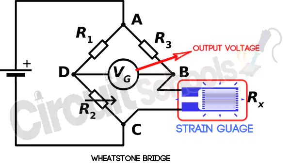
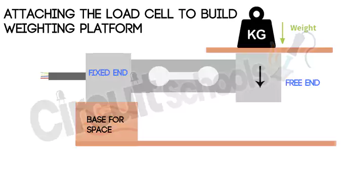
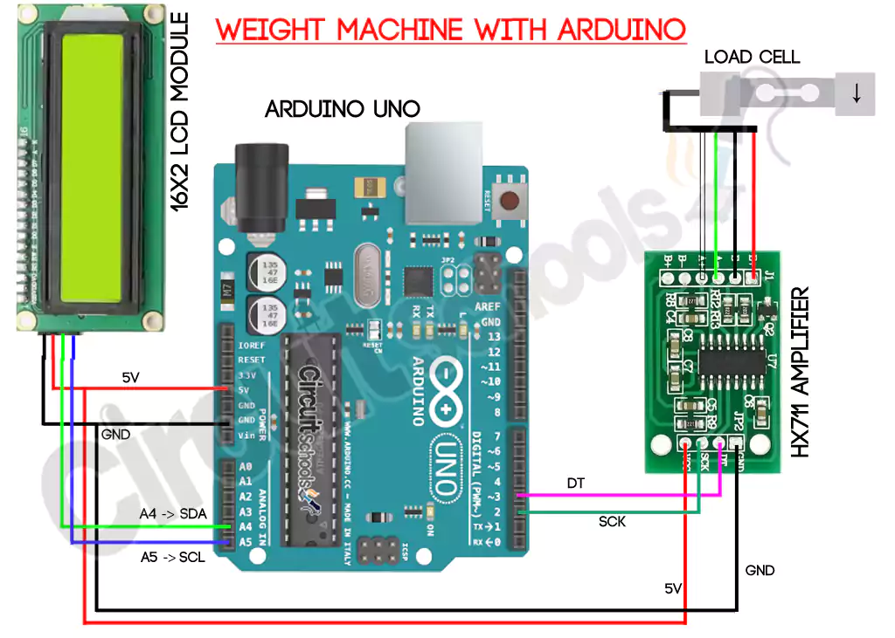

# Load Cell Sensor

- A load cell is a physical element(Also called a transducer) capable of translating pressure or force into an eletrical signal.
- Load cell are used to measure weight and are part of our daily lives.
- There are load cells everywhere,in our cars,lifts or in the weight measuring machines in supermarkets.
- They do not attract out attention because they are hidden inside other devices.
- There are three ways a load cell is capable of translating a force or pressure into an electronic signal.

## Hydraulic load cell

- As its name suggests,it is a load cell with a hydraulic system consisting of a piston and a cylinder.
- When a force is exerted on the piston,a fluid is compressed inside the cylinder and this corresponds to a pressure.

## Pneumatic Load cell

- A pneumatic load cell is a type of load cell that uses pressurized air or gas to measure force or weight.
- It consists of a flexible,air-tight chember that is subjected to a force.
- When an object is placed on it,it causes the chamber to deform.
- This deformation is measured using a pressure guage like manometer,and the pressure reading is used to calculate the applied force.

## Strain Gauge Based Load Cell

- A strain gauge is a sensor that changes its resistance depending on the pressure exerted on it due to the piezo resistive effect.
- In the case of the strain gauge, the resistance changes due to the pressure,load or deformation of the material.
- Basically if you take a strip of conductive metel and stretch it,it will get thinner and longer and the resistance will increase.
- On the contrary,if the metal strip contracts under a force,the resistance decreases.
- This strain guages allows us to relate the force to an electrical signal(a Voltage) and therefore we can measure the electrical voltages to calculate the weight.
- There are different load cells based on strain guages but they all work more or less the same.
- They very in material,size and mechanical configuration which makes each load cell have different sensitivities,and maximum and minumum measuring capacities.
- A strain gauge is made up of a very thin wire or sheet configured in such a way that there is a linear change in electrical resistance when strain is applied in a specific direction.
- So measuring the resistance of the strain gauge can give weight,But sometimes the resistance changes are really small.
- This is a real problem as we would need a device capable of measuring these small changes in resistance or take that small changes and amplify it.
- This is where the Wheatstone bridge comes into play,a very simple circuit that will allow you to detect those small variations in resistance.

## Attaching the load cell to build the weighting area

## Interfacing loadcell,HX711 load cell amplifier module with Arduino

