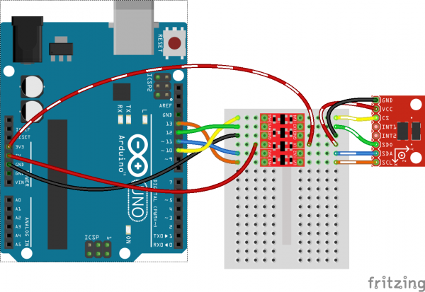

# Logic Level Shifter for Interfacing Between Devices with Different Logic Voltages

## Introduction

- Logic level shifters are essential components for interfacing devices with different logic voltages. This tutorial aims to explain the basics of logic level shifting, the methods of implementing a level shifter, and the importance of using a level shifter to prevent damage to the devices.

## Image

## How to Connect to a Circuit

- To connect devices with different logic voltages, a level shifter circuit is required. There are several methods for implementing a level shifter, including a potential divider circuit and a bi-directional level shifter. The bi-directional level shifter is the recommended method for stable and reliable communication between devices.

## The Theory Behind the Components

- A level shifter circuit consists of MOSFETs and resistors. MOSFETs are used as switches to allow or block the flow of current between the devices. The resistors are used to adjust the voltage levels to the appropriate values.

## Features

Using a level shifter provides the following features:

- Enables communication between devices with different logic voltages
- Prevents damage to the devices
- Provides stable and reliable communication between the devices

## Statistics

- The level shifter circuit has been widely used in electronic projects and is essential for interfacing between devices with different logic voltages. It is a simple and cost-effective solution that can prevent damage to the devices and ensure stable communication.
