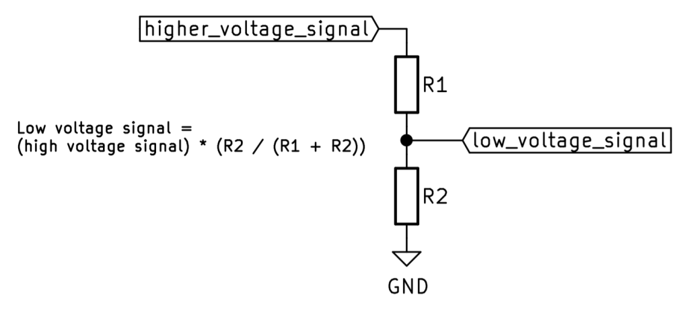
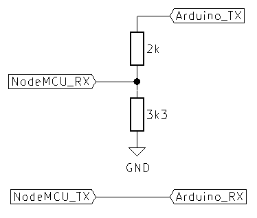
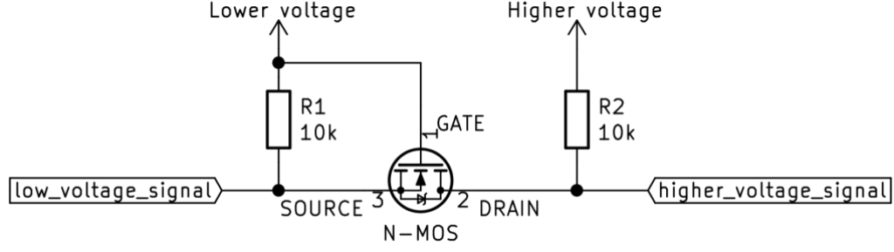
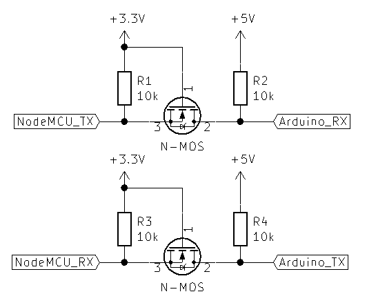

# Logic Level Shifter 
- Level Shifter are used to enable communication between devices operating at different logic levels(voltages).
- An Arduino Uno runs at 5V but a device like the NodeMCU uses 3.3V logic level.
- If you want to connect them directly, data sent from the NodeMCU to the UNO might have too much noise to be read as 3.3V is  quite close to the minimum voltage required for a logic high.
- However,if you put 5V into the NodeMCU's data lines,this could cause permanent damege and stop it working completely.
- Don't be fooled if you don't use a level shifter and things just work.
- The damage often takes a little while to take effect,but the damage is still occurring so be sure to use a level shifter if two devices are at different voltages.

## Crude level shifting in a hurry.
- Say you need a project very quikly,or you aren't too bothered if things are a tad unstable from time to time,this is very basic method of level shifting using a potential divider.

- As you can see,using UART below as an example,the sending device uses a potential divider circuit in order to reduce the sending voltage of the side which has the higher voltage.
- The lower voltage device sending to the higher voltage device just has a wire,this leaves room for noise to effect the signal more,but it will probably work and won't damage anything.
- This is a very crude method and might not even work with some devices.
- It will also only work with one way communications as it is a uni-directional situation.

- If this method doesn't work or you want the proper way of level shifing,see step 2
## Bi-directional level shifting.
- The schemic below shows how you should wire things in order to have bi-directional signal and shift send and receive voltage.

- If you use suitable logic level MOSFETs for this application(i.e high frequency logic level MOSFETs) then you will even be able to use this for protocols like 12C which rely on a bi-directional data line which won't work with the method on step 1.
- An example using UART between a 3.3V NodeMCU and a 5V Arduino is shown below.

## when to use a level shifter,
- Use a level shifter whenever you see a differing voltage between the sending and the receiving device.
- Make sure to use the method shown in step 2 whenever you can as even with the low voltage to high voltage shifting,it means that you will see the output as the higher voltage but with the same signal as the lower voltage.
- In the first example you would see the lower voltage at the higher voltage side which leads to noise issues.
- Hopefully this tutorial gives you some insight as to improve your circuits or helps you to not damage circuit in the futere (it may even examplain why circuit went pop in previous projects)

## The Circuit Configuration
