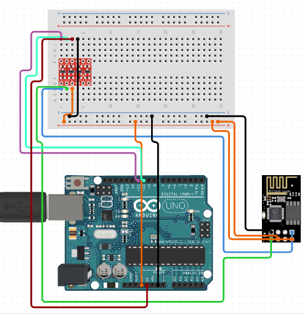

# 0036-MKR1000 Wifi Module

The MKR1000 Wi-Fi Module is an Arduino board designed to provide makers with a practical and cost-effective solution to add Wi-Fi connectivity to their projects. It has a powerful 32-bit processor, low power Wi-Fi with a Cryptochip for secure communication, and the ease of use of Arduino Software for code development and programming.

## Image

## How to Connect to a Circuit

The MKR1000 board can be connected to a circuit using a micro USB cable, which is used to connect the board to a computer. The board is shipped with male strip headers that are not mounted, allowing the user to adapt the board to their project by easily soldering them.

## The Theory behind the Components

The MKR1000 board includes a Li-Po charging circuit that allows it to run on battery power or external 5V, with automatic switching between the two sources. It runs at 3.3V and has a maximum voltage tolerance of 3.3V for its I/O pins, making it different from most Arduino boards. While output to 5V digital devices is possible, bidirectional communication with 5V devices requires proper level shifting. Li-Po batteries are charged at 4.2V with a current that is usually half of the nominal capacity (C/2), and the board is programmed with a charging time of 4 hours, after which it goes into automatic sleep mode.

## Features

- 32-bit computational power
- Low power Wi-Fi with a Cryptochip for secure communication
- Ease of use of Arduino Software (IDE) for code development and programming
- Li-Po charging circuit for battery power or external 5V, with automatic switching
- 8 digital I/O pins, 4 PWM digital I/O pins, 6 analog input pins, and 1 analog output pin
- 256KB flash memory and 32KB SRAM
- Clock speed of 48MHz

## Statistics

- In 2019, an estimated 3 billion Wi-Fi compatible devices were manufactured worldwide, which is approximately 0.4 devices per person per year.
- The MKR1000 board is recommended to be used with a Li-Po battery of at least 700mAh capacity, as smaller cells may overheat, develop internal gasses, and explode, setting the surroundings on fire.
- The charging current for the specialized chip used in the board is 350mAh, and the chip is programmed with a maximum charging time of 4 hours, limiting the amount of charge to 1400mAh per charging round.
