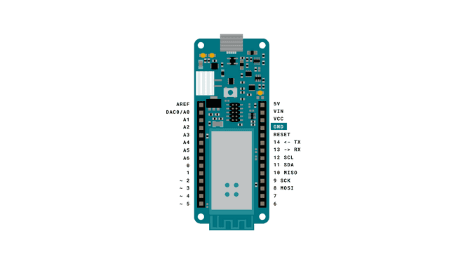

# MKR1000 Wifi Module

## What is Wi-Fi?

- Wi-Fi is a collection of wireless network protocols that are based on IEEE 802.11 Standard.
- It typically uses the 2.4gHz and 5gHz radio bands,and is a technology that is best suited for shorter ranges.
- It is usually hard to imagine any devices that connect to the internet(e.g. smartphones,laptops,smart home applications) that does not have a Wi-Fi module.
- In fact,in 2019,an estimated 3 billon Wi-Fi compatible devices were manufactured(about 0.4 per person,per year,worldwide).
- Simply explaned,Wi-Fi is used to transfer data from one device to another,for example from your computer to your router.
- Let's say we are making a request to a server from a device,the following happens
  
  - A device sends a signal to the router over Wi-Fi.
  - Router is physically connected to the internet,and sends a request to a server somewhere else in the world.
  - Server receives request,processes it,and sends it back.
  - Router receiver it,and sends it to the device.

- Now,as we all aware,this doesn't take a few minutes.It is practically instant(well not quite,but it is very fast).
- Now if you grew up before Wi-Fi ware "the thing",everything was connected by cables, and the core strength of Wi-Fi is that can send huge amounts of data,without a single cable connected to the device.
- Of course,it doesn't come entirely without complications.
- The main trade-off for using Wi-Fi technologies is mainly power consumption,which is quite high,and the range,which is quite short.

- We just need a Micro USB cable to connect MKR 1000 board to a computer.

## MKR1000 Wi-Fi Module

- Arduino MKR1000 has been designed to offer a practical and cost effective solution for makers seeking to add WiFi connectivity to their projects with minimal previous experience in networking.
- The design includes a Li-Po charging circuit that allows the Arduino MKR1000 to run on bettery power or external 5V, charging the Li-Po battery while running on external power.
- Switching from one source to the other is done automatically.

## Technology

- MKR 1000 has a good 32 bit computational power similar to the Zero board,the usual rich set of I/O interfaces, low power WiFi with a Cryptochip for secure communication,and the ease of use of Arduino Software(IDE) for code development and programming.
- All these features make this board the preferred choice for the emerging IoT battery-powered projects in a compact form factor.
- The board will be shipped with male strip header not mounted so you can adapt the board to your project by easily soldering them.
- Unlike most Arduino boards,the MKR1000 runs at 3.3V.
- The maximum voltage that I/O pins can tolerate is 3.3V.
- Applying voltage higher than 3.3V to any I/O pin could damage the board.
- While output to 5V digital devices is possible,didirectional communication with 5V devices needs proper level shifting.
- Li-Po betteries are changes at 4.2V with a current that is usually half of the norminal capacity.(C/2).
- For Arduino MKR1000 We use a specialized chip that has a present charging current of 350mAh.
- This means that the MINIMUM capacity of the Li-Po battery shall be 700mAh.
- Smaller cells will be damaged by this current and may overheat,develop internal gasses and explode, setting on fire the surroundings.
- Strongly recommend that  select a
Li-Po battery of at least 700mAh capacity.
- A bigger cell will take more time to change,but won't be harmed or overheated.
- The chip is programmed with 4 hours of charging time,then it goes into automatic sleep mode.
- This will limit the amount of charge to max 1400mAh per charging round.
  
  - Operating Voltage-->3.3V
  - USB input Voltage(Recommended)-->5V
  - Digital I/O Pins-->8
  - PWM Digital I/O Pins-->4
  - 1Analog input pins-->6
  - Analog output Pins--> 1
  - Flash Memory--> 256Kb
  - SRAM--> 32Kb
  - Clock Speed--> 48Mhz
