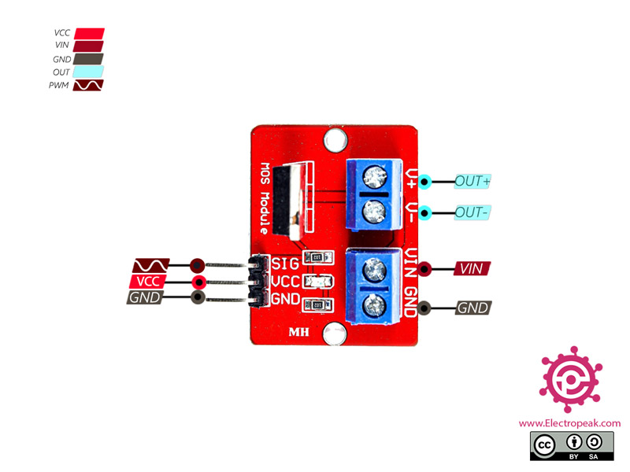

# IRF520 MOSEFET Drive Module

- This module controls DC motors by PWM(Pulse Width Modulation) technique.
- These modules convert a constant input voltage to a variable voltage.
- DC motor's speed can also be controlled by changing the voltage across it.
- PWMs usually have a constant frequency and controll the engine speed by controlling the length of that pulse is HIGH (Duty Cycle).
- Engine speed control modules are very versatile and easy to use.
-NOTE: DC motor's voltage can be 0 to 24 Volts and the maximum can be up to 5A,In high currents heatsink is required.

## IRF520 MOSFET driver Module Pinout

- VCC-Module Power Supply-5V
- GND- Ground
- SIG-PWM input signal
- Vin- Input voltage 5-24V
- Out-Module output for connecting to motor

### You can see the pinout of this module in the image below

## Circuit Diagram

