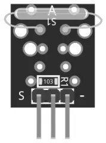
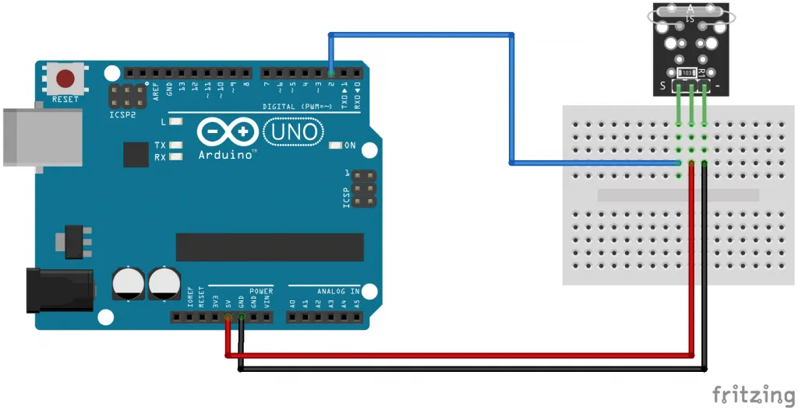

# Magnetic Reed Switch Module
- The KY-021 Magnetic Reed Switch module is a switch that is normally open and gets closed when exposed to a magnetic feild,sending a digital signal.
- Commonly used in mechanical systems as proximaty sensors.
- Compatible with Arduino,Raspberry Pi,ESP32 and other microcontrollers.For analog output see the KY-025 reed switch.

## KY-021 Specification
- This module consist of a small reed switch actuated by a magnetic feild,a 10K Ohoms resistor,and 3 male header pins.
<table>
<tr>
<th>Operation Voltage</th>
<th>3.3V~5V</th>
</tr>
<tr>
<th>Output Type</th>
<th>Digital</th>
</tr>
<tr>
<th>Board Size</th>
<th>18.5mm x 15mm</th>
<tr>
</table>

## Connection Diagram
- Connect the module's Power line(middle) and ground(-)to +5 and GND respectively.Connect signal(S)to pin 2 on the Arduino.
<table>
<tr>
<th>KY-021</th>
<th>Arduino</th>
</tr>
<tr>
<td>S</td>
<td>5V</td>
</tr>
<tr>
<td>-</td>
<td>GND</td>
</tr>
</table>
