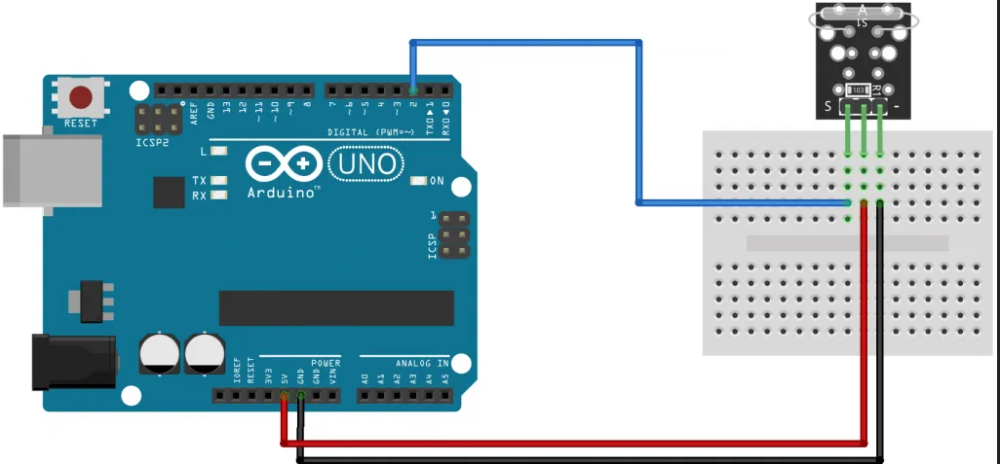

# C0025-Magnetic Dry Reed Switch

The KY-021 Magnetic Reed Switch module is a switch that gets closed when exposed to a magnetic field, sending a digital signal. It is commonly used in mechanical systems as proximity sensors and is compatible with popular microcontrollers like Arduino, Raspberry Pi, and ESP32.

## Image

## How to connect to a circuit

Connect the module's Power line (middle) and ground (-) to +5V and GND respectively. Connect signal (S) to pin 2 on the Arduino.

## The theory behind the components

This module consists of a small reed switch actuated by a magnetic field, a 10K ohms resistor, and 3 male header pins. When the switch is exposed to a magnetic field, it closes and completes the circuit, allowing current to flow through it. The 10K ohms resistor is used to limit the current through the switch and to protect it from damage.

## Features

- Normally open switch that gets closed when exposed to a magnetic field.
- Digital output signal.
- Compatible with popular microcontrollers like Arduino, Raspberry Pi, and ESP32.

## Statistics

- Operating voltage: 3.3V~5V.
- Output type: Digital.
- Board size: 18.5mm x 15mm.
