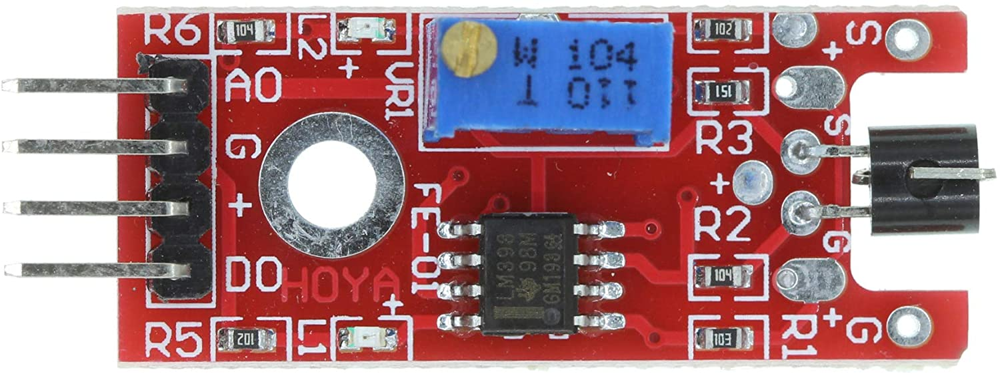
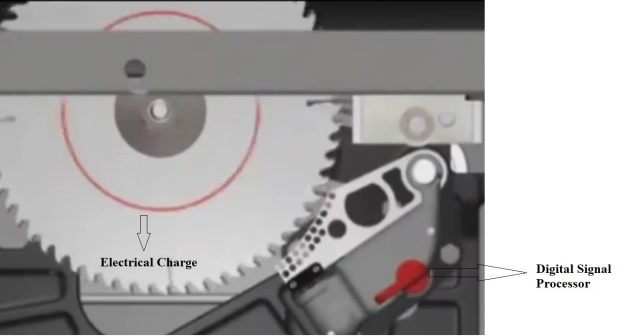
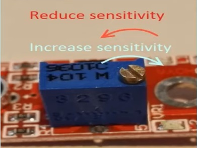
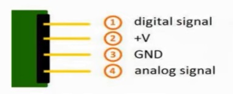

## Metal Touch Sensor
- The KY-036 metal touch sensor module 
features a darlington and PN transistor,the signal which is controlled by LM393 Comparator IC which consists of two comparators.
- When you touch the bar wire meant over the transistor which is represented by the base of the transistor.

- The 50 hertz signal us in a modern home or office is injected into a high gain amplifier the output of this amplifier is connected to the comparator.
- The AC signal is then converted to the square wave.We can ajust the sensitivity of the sensor by adjusting the trimmer.
- When we will touch the sensor the led will starts blinking.
- If you look closely at the led you will see a slight flicker this is due to the output that is represented by a square wave of 50 hertz instead of constant value.
- This module has integrated on board touch sensor which consists of potentiometer on microchip,six resistors and two LEDs.
- The resistor R1 used in this module is 10-Kilo ohoms the resistor R2 is 100-Kilo ohms the resistor R3 is 150 ohms resistor R4 is 1-kilo ohm the resistor R5 is 1-Kilo ohm the resistor R6 is 100-Kilo ohms and the main reason for using the resistors is to limit current from burning the module.
- The LED L1 in the module lights up to show if the module is working properly or not and the LED L2 lights up every time when we touch the sensor.
## Features of the KY-036 touch sensor.
- These are some features of the sensor.
   - It has a power supply 3.3 volt or 5.5 volt.
   - Its sensitivity is adustable 
   - It has an analog and digital output
   - Packaging:antistatic sealed bag
   - From dimensions 34x16 mm
- There are two buil-in LEDs on the sensor module.
- The LED1 shows that the sensor is supplied with voltage and the LED2 will shows that the sensor is detecting magnetic feild.
- The main component of the KY-036 Metal Touch sensor module on its circuit board is the sensor unit at the front of the module which measures the area physically and send an signal to analog output of the Metal Touch Sensor module.
- The third component is a under a specific value you can control the sensisitivity by adjusting the potentiometer,here please note high value it is show absolute value it is a relative measurements you define an exteme value to a given normal environment situation and a signal will be sent if the measurement exceeds the extreme value.
## KY-036 Metal Touch sensor module Application
- The way the KY-036 Metal Touch Sensor module works is that it detects electrical conductivity and out bodies are like big conductors and if we touch the sensor then the Arduino will detect a signal.
- We use this kind of technology every day with touch screen on our mobile devices.
- A good example of this sensor is the security of table saws the technology behind it's actually quite simple the blade carries a small electrical charge.

- This charge is continuosly monitored by a digital signal processor when contact is made the human body absorbs some of the charge causing the voltage drop, the drop in voltage triggers a quick release aluminum break,a heavy-duty spring forced the break into the teeth of these spinning blade the teeth dig into the alumininum  stopping,the blade cold the blades momentum forces it to retract below the table and the motor is automatically shut off.

## working Principle of the KU-036:

- Basically,the funtionality of the Metal Touch sensor Module is devided into three main components first the sensor unit at the front of the module which measures the area physically and sends an analog signal to the second unit the amplifier.
- The amplifier basically amplifies the signal and according to the resistance value of thr potentiometer and set the sensitivity of the sensor by adjusting the knob of the potentiometer.
- If you rotate it in clockwise direction you can reduce the sensivity as shown in the diagram.

- the comparator will switches the digital out and turn on the led if the signal under a specific value.

## KY-036 Pinout:

- It has basically four pins digital signal,VCC +V,Ground and analog signal.

## Interfacing KY-036 with arduino, circuit:
