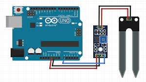

# Moisture Sensor
- The soil moisture sensor consists of two probes that are used to measure the volumatric content of water.
- The two probes allow the currenr to pass through the soil, which gives thw resitance value to measure the moisture value.
### How to make a moisture sensor ?
- Connect to two pind from the sensor to the pins on the Amplifier circuit via hool up wires.
- Commct the VCC from the Amplifier to the 3.3V pin on the Arduino and the GND pin to the GND pin on the Arduino.
- Now connect the Analog Data Pin to the A0 pin on the Arduino.
 

- A resistor soil moisture sensor works by using the relationship between electrical resistance and water content to gauge the moisture levels of the soil.;
- The Soil Moisture measures soil moisture grace to the changes in electrical conductivity of the Earth.