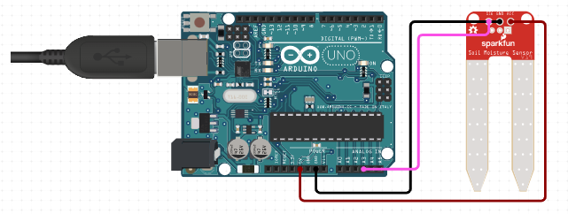

# C0007-Moisture sensor

## Introduction

- A moisture sensor is an electronic device that is used to measure the water content of soil. It helps farmers to determine when and how much to water their crops.
- The moisture sensor works by measuring the electrical conductivity of the soil, which changes with the amount of water present in it.

## Image

## How to connect to a circuit

- To connect the moisture sensor to a circuit, follow these steps:

- Connect two pins from the sensor to the pins on the amplifier circuit using hookup wires.
- Connect the VCC from the amplifier to the 3.3V pin on the Arduino and the GND pin to the GND pin on the Arduino.
-Connect the Analog Data Pin to the A0 pin on the Arduino.

## The theory behind the components

- A resistor soil moisture sensor works by using the relationship between electrical resistance and water content to gauge the moisture levels of the soil.
- The two probes of the sensor allow the current to pass through the soil, which gives the resistance value to measure the moisture value.
- The amplifier circuit amplifies the small signal from the sensor and provides a stable output for the microcontroller to read.

## Features

- Some common features of a moisture sensor include:

- Easy to use and install
- Can be integrated with microcontrollers
- Can measure the water content of soil in real-time
- Can save water and increase crop yield
- Can help prevent over-watering and under-watering of plants

## Statistics

- The accuracy of the moisture sensor can vary depending on the type of sensor used and the soil conditions. However, a good quality moisture sensor can provide an accuracy of up to +/- 2% VWC (volumetric water content). The lifespan of a moisture sensor can range from a few months to several years, depending on the type of sensor and its usage.