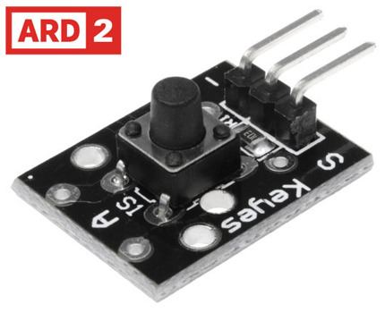

# Push Button Module

- This push button sensor Arduino compatible allows you to control your Arduino project with the press of a button.
- It's perfect for whenever you need simple input  in you project.
## Features
- Push button switch suitable for Arduino project.
- Digital switch output(0 and 1)
## Specfication
<table>
<tr>
<th>Output</th>
<td>Digital Switch(0 and 1)</td>
</tr>
<tr>
<th>Board Color</th>
<td>Black</td>
</tr>
<tr>
<th>Material</th>
<td>PCB</td>
</tr>

</table>