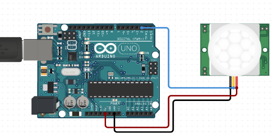

# C0002-Motion sensor

## Introduction to motion sensors:

- Motion sensors are devices that are designed to detect and measure movement in their surroundings. These devices are used to detect and measure movement. 
- They are commonly used in home and business security systems, but can also be found in phones, paper towel dispensers, game consoles, and virtual 
  reality systems.   
   
 ## How they work:

- Motion sensors work based on various principles and technologies, and their primary function is to detect movement or motion in their surroundings. Here 
  are the common types of motion sensors and how they work:

## 1. Passive Infrared (PIR) Sensors:

- Working Principle: PIR sensors detect infrared radiation emitted by living beings and objects. They consist of pyroelectric sensors that generate 
 electrical signals when exposed to changes in infrared radiation.

## How They Work: 
- When a person or an object moves within the sensor's field of view, it detects the change in infrared radiation. The sensor then triggers a response, such 
  as turning on lights or sounding an alarm.

## 2. Ultrasonic Sensors:

   - Working Principle: Ultrasonic sensors emit ultrasonic waves (sound waves at frequencies higher than the human ear can hear) and measure the time it 
     takes for the waves to bounce back after hitting an object.

## How They Work: 
   If an object, including a person, is in motion, the ultrasonic waves bounce back more quickly than they were transmitted. The sensor detects 
   this change in time and triggers an action, like activating automatic doors or turning on lights.

## 3. Microwave Sensors:

Working Principle: Microwave motion sensors emit continuous microwave signals and measure the reflections. Moving objects cause a shift in the frequency of the reflected waves due to the Doppler effect.

## How They Work: 
Changes in the frequency of the reflected waves indicate movement. Microwave sensors are highly sensitive and can detect motion through walls and other obstacles. They are commonly used in security systems.

## 4. Dual Technology Sensors:

Working Principle: Dual technology sensors combine two different technologies, often PIR and microwave, to enhance accuracy and reduce false alarms.

## How They Work:
Both PIR and microwave sensors must detect motion simultaneously for the sensor to trigger an action. This dual verification reduces the likelihood of false alarms caused by non-human movements or environmental factors.

## 5. Infrared (IR) Sensors:

Working Principle: Infrared sensors detect infrared radiation emitted by objects or people in their field of view.

## How They Work: 
IR sensors can be used for both motion detection and proximity sensing. When an object or person moves, the sensor detects the change in the infrared radiation pattern, allowing it to trigger a response.
Motion sensors are commonly used in security systems, automatic lighting, smart home devices, and various other applications where detecting movement is essential.The choice of motion sensor depends on the specific requirements of the application and the environmental conditions in which they are deployed.

## Image

## How to connect it to a circuit:

The specific instructions for connecting a motion sensor to a circuit will depend on the type of motion sensor being used and the circuit being built. Generally, motion sensors will have pins or wires for connecting to power (usually 5V or 3.3V), ground, and a digital input pin on a microcontroller (such as an Arduino). It's important to consult the datasheet for the specific motion sensor being used and follow the manufacturer's instructions.

## The theory behind the components:

Motion sensors typically consist of three major components: a sensor, an embedded computer, and hardware. Active sensors have both a transmitter and receiver, and detect motion by measuring changes in the amount of sound and radiation reflecting back into the receiver. Passive sensors, on the other hand, detect motion based on a perceived increase of radiation in its environment. The most widely used type of passive motion sensor is the passive infrared (PIR) sensor, which detects the infrared radiation emitted naturally from the human body.

## Features:
 Motion sensors come with various features designed to cater to specific needs and applications. Here are a few key features commonly found in motion sensors:

## Adjustable Sensitivity: 
Many motion sensors allow users to adjust the sensitivity level. This feature is useful for fine-tuning the sensor's response to motion, ensuring it is effective in different environments and scenarios.

## Detection Range:
Motion sensors have specific detection ranges, indicating how far they can detect motion. Some sensors allow users to adjust the detection range to suit the specific area they want to monitor.

## Pet Immunity:
Advanced motion sensors are equipped with pet immunity technology, allowing them to distinguish between the movement of pets and humans. This helps prevent false alarms in homes with pets.

## Dual Technology:
Dual technology motion sensors combine multiple sensing technologies (such as PIR and microwave) for enhanced accuracy and reduced false alarms. Both sensors must be triggered simultaneously to activate, increasing reliability.

## Daylight Sensing:
Some motion sensors include daylight sensing capabilities. They can differentiate between natural daylight and artificial light, ensuring that lights are only activated in low-light or nighttime conditions.

## Time Delay Settings: 
Motion sensors often come with adjustable time delay settings. Users can configure how long the connected devices remain active after the sensor detects motion. This feature helps in conserving energy by turning off lights or devices after a specific period of inactivity.

## Coverage Patterns:
Motion sensors can have different coverage patterns, including 180-degree, 360-degree, or custom patterns. The choice of coverage pattern depends on the intended application, such as narrow corridors or large open spaces.

## Tamper Resistance:
High-quality motion sensors are designed to be tamper-resistant, meaning they can detect attempts to tamper with or disable the sensor. This feature enhances security and ensures the sensor continues to function properly.

## Wireless Connectivity:
Many modern motion sensors are wireless and can communicate with other devices and controllers using wireless protocols like Zigbee or Z-Wave. Wireless connectivity simplifies installation and integration into smart home systems.

## Battery Life:
For battery-powered motion sensors, long battery life is a crucial feature. Low-power designs and efficient energy management help prolong the lifespan of the sensor's batteries, reducing the frequency of replacements.

## Weather Resistance:
Motion sensors intended for outdoor use may come with weather-resistant or waterproof features, allowing them to withstand exposure to various weather conditions like rain, snow, or extreme temperatures.

## Integration with Smart Home Systems: 
Motion sensors can be integrated into smart home automation systems, allowing users to create customized automation routines based on detected motion. Integration with platforms like Amazon Alexa or Google Assistant enables voice control and enhanced functionality.

- Motion sensors can be customized to perform highly specific functions, such as activating floodlights, triggering audible alarms, activating switches, and even alerting the police. 
- There are different types of motion sensors, including active and passive sensors, and different technologies used to detect motion, such as ultrasonic, microwave, and thermographic sensors.

## Statistics:

- There is no specific statistics related to motion sensors as a whole, as their use and effectiveness will depend on the specific application and environment they are used in. 
- However, motion sensors are widely used in home and business security systems, and have been shown to be effective in deterring burglars and intruders.
