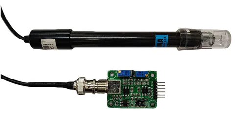
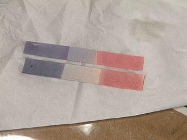
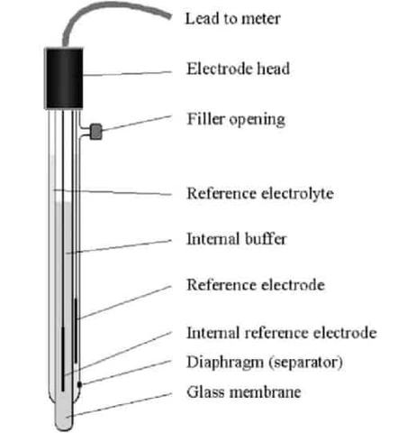
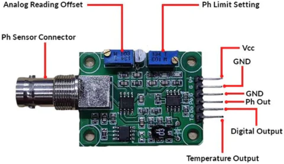

# pH Sensor

- One of the most important instrument for measuring the quality of water is pH Sensor, which frequently employed in the monitoring of water quality.
- It is possible to measure the alkalinity and acidity of water and other solutions with this type of sensor.
- pH sensor help assure the safety and quality of wastewater from manufacturing facilities when they are used properly.
- The traditional method for measuring the quality or pH of water is by using pH indicators.
- Although they cannot provide a precise reading of the pH,they can be used for assessing whether a substance is an acid or a base.
- Limus,phenolphthalein,and methyl orange are the three primary pH indicators frequently used in laboratories.
- To estimate pH,these indicators rely on visible color changes.
- However,it is now standard procedure to measure pH with a pH meter or sensor.

## pH Sensor working principle

- The exchange of ions from the solution to the inner solution of the glass electrode via the glass membrane is the basis for the pH sensor's operation.With continued usage,the glass membrane's porosity decreases,lowering the probe's performance.

- The pH sensor is often made of glass and has a rod-like construction with a bulb at the buttom that hols the sensor.
- A glass bulb that is specifically made to be selective to hydrogen-ion concentration is present in the glass electrode used to measure pH.
- Hydrogen ions in the test solution exchange with other positively changed ions on the glass bulb upon immersion in the solution under test,creating an electrochemical potential across the bulb.
- The electronic amplifier,which transforms it into pH units.
- The Nernst equation states that the electrochemical potential accross the glass bulb is linearly linked to pH.

- Since the reference electrode is made of a metalic conductor that is connected to the display,it is insentitive to the pH of the solution.
- A poruos ceramic membrane allows the electrolyte solution- typically potassium chloride in which this conductor is submerged to interact with the test solution.
- Voltmeters that display voltage in pH units make up the display.
- This pH sensor is connected to the transducer called the transmitter or signal conversion board.
- This board includes a pH sensor connector which is connected to the sensor probe,pH limit setting,Analog reading Offsets and six IO pins.

- This pH sensor is a piece of equipment used in science to determine whether a solution is naturally acidic or alkaline.
- pH levels can be detected between o and 14 by the sensor set.
- This pH sensor kit can be used to access the quality of both soil and water.
- As part of the sensor package,a pH probe and sensor board will be used to condition the signal.

## Specifications

- Voltage 5V
- Current 5-10mA
- Concentration range pH 0-14
- Temperature 0-60 Degree celcius
- Response time <=5s
- Stability time <=120s
- Power consumption <=0.5W
- Size 42mm X 32mm X 20mm
- weight 25g

## Types of pH sensors

- Combination sensor
- Differential pH sensor
- Lab grade pH sensor
- Process pH sensor

## How to connect pH sensor to Arduino module

