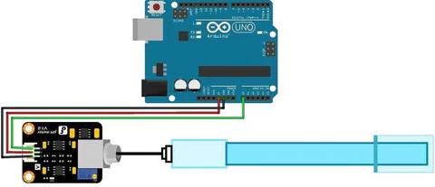

# C0042-pH Sensor

A pH sensor is an essential instrument used to measure the quality of water, which is crucial for various applications. pH sensors can measure the acidity and alkalinity of water and other solutions, making them useful in monitoring water quality. In this article, we will discuss the working principle, types, and specifications of pH sensors.

## Image

## How to connect to a circuit

- To connect a pH sensor to an Arduino module, a circuit diagram is shown.
- The pH sensor is connected to the Arduino module through the signal conversion board.
- The pH sensor connector is connected to the sensor probe, pH limit setting, Analog reading Offsets, and six IO pins.

## The theory behind the components

The pH sensor works on the principle of ion exchange, where the hydrogen ions in the test solution exchange with positively charged ions on the glass bulb of the sensor. This creates an electrochemical potential across the bulb, which is measured by the electronic amplifier and transformed into pH units using the Nernst equation. The reference electrode is made of a metallic conductor that is insensitive to the pH of the solution, and a porous ceramic membrane allows the electrolyte solution to interact with the test solution.

## Features

- PH sensors can detect pH levels between 0 and 14 and are useful in assessing the quality of both soil and water.
- There are different types of pH sensors available, including combination, differential, lab-grade, and process pH sensors.
- The specifications of a typical pH sensor include voltage, current, concentration range, temperature, response time, stability time, power consumption, size, and weight.

## Statistics

- Voltage: 5V
- Current: 5-10mA
- Concentration range: pH 0-14
- Temperature: 0-60 Degree Celsius
- Response time: <=5s
- Stability time: <=120s
- Power consumption: <=0.5W
- Size: 42mm X 32mm X 20mm
- Weight: 25g
