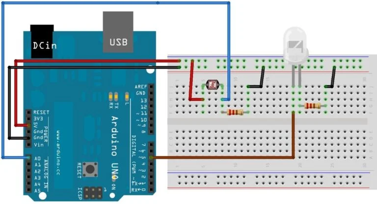

# C0022-Photo Resistor Sensor

## Introduction

- A photoresistor is a type of semiconductor device that changes its resistance as the light intensity in its surroundings changes. This sensor is used in a variety of applications, including automatic streetlights, cameras, and other electronic devices.

## Image

## How to Connect to a Circuit

- To control an LED using a photoresistor, we need to set the threshold value in the microcontroller code to turn the LED on and off. The hardware assembly includes connecting the photoresistor with the analog pin A0 of the Arduino Uno and connecting the LED with the digital pin 5 of the Arduino Uno. The photoresistor is also connected to the 5V and Ground pins of the Arduino Uno.

## Theory Behind the Components

- When the light intensity increases in the surroundings of the photoresistor, electrons in the valence shell break the bonds and become free electrons, creating holes and allowing the flow of electricity. The resistance of the resistor is high when the light intensity is low, and there is no current flow. However, when the light intensity increases, the current starts to flow, causing the resistance to decrease.

## Features

- The photoresistor is a simple and inexpensive sensor that is used to detect the presence of light. It is easy to interface with microcontrollers and is commonly used in various applications, including automatic lighting systems and light meters.

## Statistics

- The resistance value of a photoresistor typically ranges from a few hundred ohms to several megohms, depending on the intensity of light in its surroundings. They can be found in various sizes and shapes, such as round or square, and are available with different sensitivities to light.