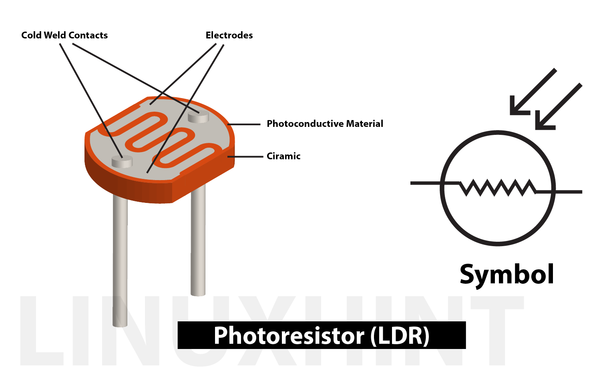
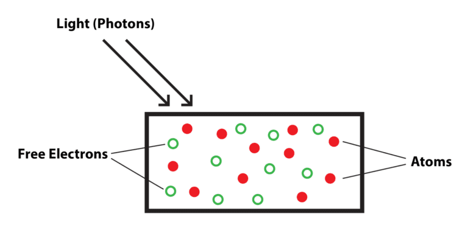
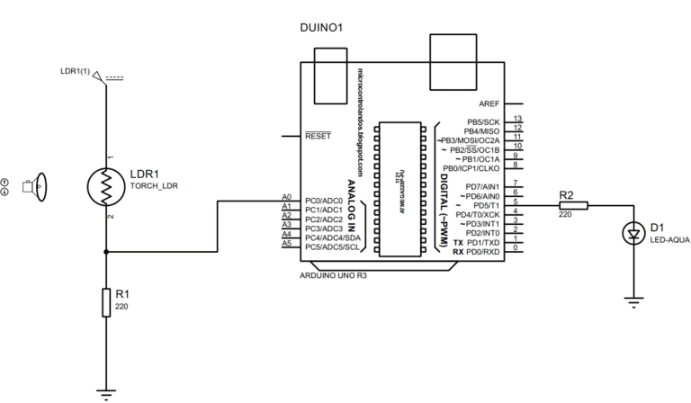

# Photo Resistor Sensor
### What is the photoresister 
- From the name we can understand that it is also a type of resistor whose resistance values change as the light intensity is changed in its surroundings.

## How does a photoresister work?
- The photoresister is a type of a semiconductor device and when the light intensity increases in its surrounding the electrics in the valence shell break the bonds and become free electrons as a result holes are created which create the flow of electricity.
- Normally when light intensity is low the resistance of the resitor is quite high and there is no current flow.
- However, when the light intensity increases the current starts to flow which causes the resistance to decrease and, in this way,the photoresistor works.

## How to control the LED using Photoresistor(LDR) with Arduino.
- To control the light with a photoresister is quite simple,we just have to set the threshold value in the microcontroller code by which the LED will turn on and off.
- The pactrical application for the use of photoresistor is making automatic street light which automatically turn off when the sun rises and turn on after sunset. 

## How to create hardware assembly for controlling LED using photoresister(LDR)with Arduino Uno
- To implement the circuit on the hardware we have first defined the hardware assembly given in the image below:

- To use the photoresistor for controlling the LED we have connected the photoresister with the analog pin A0 of the Arduino Uno using the blue wire.
- Whereas to connect the LED we have used the digital pin 5 of the 
arduino uno using the brown wire.
- To connect the photoresistor with the supply we have used the 5 Volt and Ground pin of the Arduino Uno.

