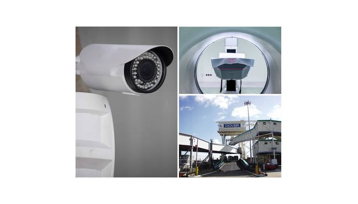
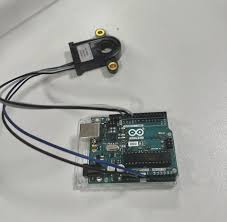

# Position Sensor

- The position sensor is a device that collects that information on the precise position and movement of an object.
- The information can be obtained by direct contact with the object or remotely using magnetic sensors.
- It can also detect the thickness of a part,the level of a fluid or the angle of rotstion of a shaft.

## Uses of position sensors

- Position Sensors can be used to measure either linear or rotary position using a whole range of sensing technologies.
- Position Sensors are used for many different applications, anything which requires measurement of movement will use a type of position sensor.

- A position sensor is a sensor that facilitates the measurement of mechanical position.
- They can be used to communicate the location/ absolute position or displacement/relative position regarding traveling,three-dimension space, or rotational angle.
- Proximity sensors are a form of position sensors.
- The specific parameters of a position sensor will define its performance but they may change based on the type of sensor being selected.
- Some main specifications of position sensors include a range of measurement,accuracy, resolution,linearity and repeatability.

## Circuit Diagram

.jpeg)
