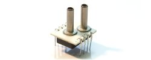

# C0010-Pressure sensor
## Introduction to pressure sensors 

A pressure sensor, also known as a pressure transducer or pressure transducer, is a device used to measure the pressure of gases or liquids. It converts the physical force exerted on the sensor due to the pressure of the fluid into an electrical signal, which can then be interpreted, displayed, recorded, or used to control a process.

Pressure sensors are employed in a diverse range of applications across various industries. They are crucial for monitoring and controlling processes where pressure needs to be measured accurately. Here are some key points about pressure sensors:

## How Pressure Sensors Work
Pressure sensors work on the principle that a change in pressure applied to a specific area will result in a proportional change in an electrical property, such as resistance, capacitance, or voltage. The sensor detects this change and converts it into an electrical signal, which can be processed and utilized by electronic systems.

## Types of Pressure Sensors

- Strain Gauge Pressure Sensors
--These sensors use a flexible diaphragm that deforms under pressure. Strain gauges attached to the diaphragm measure the deformation, which is then 
  converted into an electrical signal.

- Piezoelectric Pressure Sensors
--Piezoelectric pressure sensors generate an electrical charge in response to applied pressure. They are often used in dynamic or high-frequency applications.

- Capacitive Pressure Sensors
--These sensors measure changes in capacitance resulting from the deformation of a diaphragm under pressure. The change in capacitance corresponds to the 
  applied pressure.

- Resonant Pressure Sensors
--Resonant pressure sensors use the change in resonant frequency of a vibrating element under pressure to measure pressure variations.

- Piezoresistive Pressure Sensors
--Piezoresistive sensors utilize the change in electrical resistance of certain materials (piezoresistors) under stress, allowing for the measurement of 
  pressure changes.

- Optical Pressure Sensors
--Optical pressure sensors use the change in optical properties, such as refractive index, due to pressure, to measure pressure variations.

## Applications of Pressure Sensors

Pressure sensors are indispensable in many technological advancements, providing essential data for various applications and ensuring safety and efficiency in numerous industries.

- Automotive Industry
--Pressure sensors are used in automotive systems to monitor tire pressure, engine performance, and airbag deployment.

- Industrial Processes
--Pressure sensors are integral in industrial applications for monitoring and controlling processes involving gases and liquids.

- Medical Devices
--Pressure sensors are used in medical equipment such as blood pressure monitors, ventilators, and infusion pumps.

- Aerospace
--Pressure sensors are employed in aircraft and spacecraft for altitude measurement, cabin pressure control, and other critical functions.

- Weather Forecasting
--Pressure sensors are used in weather stations to measure atmospheric pressure, which is crucial for weather forecasting.

- Hydraulics
--Pressure sensors are used in hydraulic systems to monitor fluid pressure, ensuring efficient operation and safety.

- Consumer Electronics
--Pressure sensors are integrated into smartphones and smartwatches for features like altitude measurement and weather forecasting.

## Image

## How to connect to a circuit

The method of connecting a pressure sensor to a circuit may vary depending on the specific type of sensor and circuit. However, in general, pressure sensors are connected to an electrical circuit through wires or pins, and the output signal is sent to a microcontroller or display unit.

## The theory behind the components

- Pressure sensors work by detecting the pressure exerted on them and converting it into an electrical signal.
- There are several types of pressure sensors, including strain gauge, piezoelectric, capacitive, and resonant. 
- Each type operates on a different principle to measure pressure.

## Features

- Pressure sensors can vary in their features, depending on the specific type and application. 
- Some common features include pressure range, accuracy, response time, and output signal type (analog or digital).
- Additionally, some sensors may be designed for specific environments, such as high temperatures or corrosive substances.
