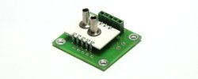
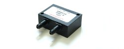
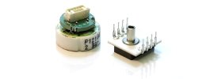

# Pressure Sensor
- A Pressure sensor(sometimes pressure transducer or transmitter) measures the physical quantity pressure and converts it into a standardized electric measurement signal.
- At analog Microelectrics we develop and manufacture a multitude of electronic pressure sensors in multiple design and variants for example with different electrical outputs,pressure connections and packeges.
## OEM pressure sensor
 
  
 - Board mount sensors for gage, (bidirectional) differential, absolute and barometric pressure with analog or digital output
## Pressure sensor modules

 
- PCB sensor modules for gage,absolute (bidirectional) differential, barometric pressure with current or voltage output.
## Pressure Transmitter 

 
- Mini transmitters for gage,absolute(bidirectional) differential and barometric presure with current-loop or voltage output.
## Customized Solutions

 
- pressure sensors tailored to your specific needs.
