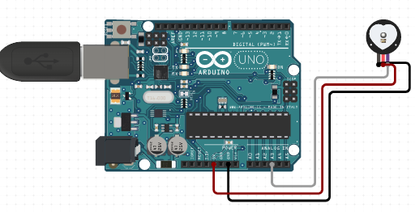

# C0033Pulse Sensor

The Pulse Sensor is a simple and easy-to-use heart-rate sensor for Arduino. It can be clipped onto the earlobe or fingertip and measures the heart rate by detecting the changes in blood volume and capillary blood flow.

## Image

## How to Connect to a Circuit

The Pulse Sensor operates from a 3.3 to 5.5V DC voltage supply. It has three pins - VCC, GND, and Signal. Connect the VCC pin to a 3.3V or 5V pin on the Arduino, the GND pin to a GND pin on the Arduino, and the Signal pin to the A0 pin on the Arduino.

## The Theory behind the Components

The Pulse Sensor works based on the photoplethysmography (PPG) technique, which measures the changes in blood volume by shining a light into the skin and detecting the amount of light absorbed or reflected by the blood vessels. The green LED in the Pulse Sensor illuminates the skin and the ambient light photosensor detects the changes in the reflected light. The MCP6001 Op-Amp IC and the R/C filter network amplify and filter the signal to obtain a clean and accurate heart rate measurement.

## Features

- Plug-and-play heart-rate sensor for Arduino
- Easy to use and clip onto the earlobe or fingertip
- Uses PPG technique to measure changes in blood volume and capillary blood flow
- Green LED illuminates the skin and ambient light photosensor adjusts brightness
- MCP6001 Op-Amp IC and R/C filter network amplify and filter the signal
- Works with a 3.3 to 5.5V DC voltage supply

## Statistics

- The Pulse Sensor can measure heart rate (BPM) ranging from 30 to 250 beats per minute (BPM) with an accuracy of +/- 2 BPM.
- The sampling rate is 500 Hz, and the resolution is 10 bits.
- The Pulse Sensor can be used in a wide range of applications, including fitness monitoring, health tracking, and biometric authentication.
