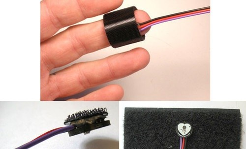
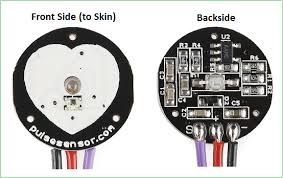
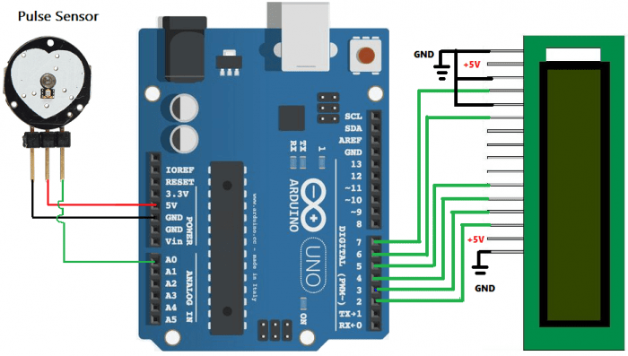

# The pluse sensor

- The pulse Sensor is a plug-and-play heart-rate sensor for arduino.
- Clip the Pulse Sensor to your earlobe or fingertip.
- The front of the sensor comes with the heart logo.This is where you place your finger.
- On the front side, you will see a small round hole,from where the green LED shines.
- Just below the LED is a small ambient light photosensor APDS9008 which adjust the bridhtness in different light condition.
- On the back of the module you will find MCP6001 Op-Amp IC,a few resistors,and capercitors.
- This makes up the R/C filter network.There is also a reverse protection diode to prevent damage if you connect the power leads reverse.

- VCC- The module operates from a 3.3 to 5.5V DC voltage supply.
- GND- is connected to the GND pin.
- Signal- is connected to thr A0 pin.

## Pluse Rate(BPM) monitor using Arduino and pluse sensor

