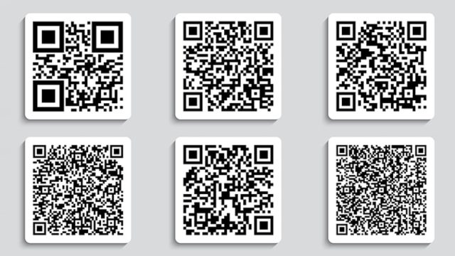
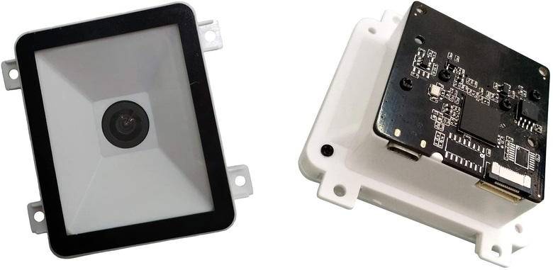
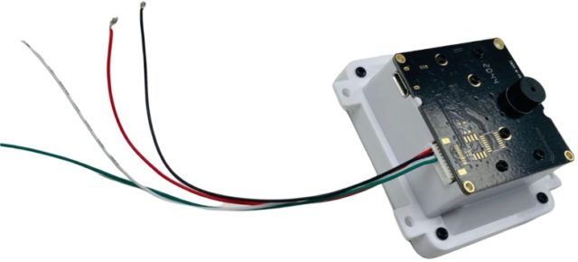
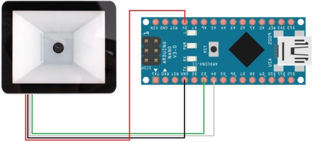

# QR Reader

## Barcode

- A barcode represents the line of numbers printed undernearth it with a pattern of black and white bars.
- Barcodes are designed for computers to read quickly by scanning red LED or laser light across them.

- Each digit in a barcode is represented by seven equal-sized vertical blocks.
- These are colored in either black or white to reprent the decimal numbers 0-9.
- Every number ultimately consists of four fat or thin black and white stripes and its pattern is designed so that,even if turn it upside down,it can't be confused with any other number.

## How does a barcode scanner work?

- A barcode scanner scans digitally convert printed barcodes.it then decodes the data and sends the data to a computer.
- It consists of a lens,a source of light,and a light sensor that can be translate optical impulses into elctrical signals.
- A barcode scanner contains a decoder that analyses the image data provide by the sensor and sensor it to the output port.
- After scanning an image,it links to a host computer to pass along captured information.

- The decoder recognizes the barcode symbols,translates the bar and space content,and transmits the data to a computer in such a format that we can read.

## What is QR code and how it works?

- A QR code is a scannerble barcode encoded with data.Encoded means converted into a particular form.
- In the case of QR codes, numeric and alphanumberic characters,bytes and kanji convert into a unique two-dimensional arrangement of squares.
- When an optical scanner passes over those squares,the translates their arrangement back into that data's original form.

- The most important parts of a QR code are the Data module,Position marker and Quiet zone.
.jpg)

- Data module is the standard unit of the QR code.It's typically a black square set against a white background.
- There are three position markers on every QR code.
- Consisting of an inner and outer eye,they allow scanners and cameras to quickly and accurately locate the data modules and the scanning direction.
- The quiet zone is the blank area on all sides of the data module matrix that contains all the data modules and position mzarkers.
- It allows scanners and readers to optically place where the QR code begins and ends.

## How QR code scanner work?

- The patterns within QR codes represent binary codes that can be interpreted to reveal the code's data.
- A QR reader can identify a standard QR code based on the three large squares outside the QR code.
- Once it has identified these three shapes,it knows that everything contained inside the square is a QR code.
- The QR reader then analyzes the QR code by breaking the whole thing down to a grid.
- It looks at the individual grid squares and assigns each one a value based on whether it is black or white.
- It then groups grid squares to create larger patterns.

## Maikrt Embedded QR code Barcode Scannering Module

- The Maikrt Embedded QR code barcode scanning module is a small 1D/2D codes reader.
- It can be embedded in any device for scanning code to identify other items.
- It uses the intelligent image recognition algorithm for reading QR or Barcode dara.
- It can easily capture bar codes 1D,2D on labels,labels,paper and mobile phone or computer displays.
- The module has the best sensivity and high accurancy.

- The module has both USB and TTL interfaces for direct interfacing with a computer or a microcontroller.
- It is equipped with 9 pin terminal line and USB cable,which is convenient for you to convert between the UART TTL serial port and USB interface.
-Using the USB interface,the module scans the code directly and sends the result to host computer automatically.
- After receiving the Data,the host computer can proceed to next step.

- The module has 9 pin 4 wire terminal line for interfacing with a microcontroller.
- The red wire is the VCC (+5V) pin ,black is the GND.
- The green and white wires are the TX and RX pins.

## Interface Barcode with Arduino

