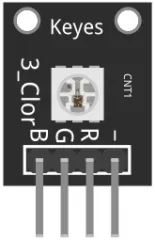
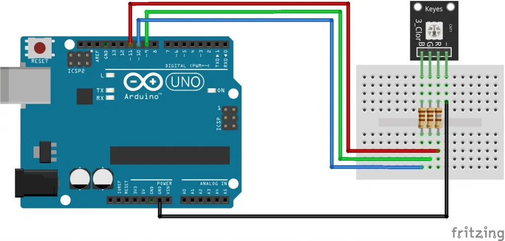

# RGB SMD Module

- The KY-009 RGB Full color LED module emits a range of color by mixing red,green and blue light.Each color id adjusted by using PWM.
- Compatible with popular electronics platforms like Arduino,Raspberry Pi and ESP32.

## KY-009 Specifications

- This module consists of a 5050 SMD LED and 4 male header pins.Use with limiting resistors to prevent LED burnout
<table>
<tr>
<th>Operating Voltage</th>
<td>5V max Red 1.8V~2.4V Green 2.8V~3.6V Blue 2.8V~3.6V</td>
<tr>
<th>Forward Current</th>
<td>20mA~30mA</td>
</tr>
<tr>
<th>Operating Temperature</th>
<td>-25`C to 85`C</td>
</tr>
<tr>
<th>Board Diemsions</th>
<td>18.5mm x 15mm</td>
</tr>
</table>

## Connection Diagram

- Connect the red pin(R)to Pin 9, the green pin (G)to pin 1o,the blue pin (B) to pin 11 and finally the ground pin(-) to GND.
-You must use resistors between the board and the arduino to prevent LED burnout

<table>
<tr><th>KY-009</th>
<th>Breadboard</th>
<th>Arduino</th>
</tr>
<tr>
<td>R</td>
<td>180 ohm resistor</td>
<td>Pin 9</td>
</tr>
<tr>
<td>G</td>
<td>110 ohm resistor</td>
<td>Pin 10</td>
</tr>
<tr>
<td>B</td>
<td>110 ohm resistor</td>
<td>Pin 11</td>
</tr>
</table>
